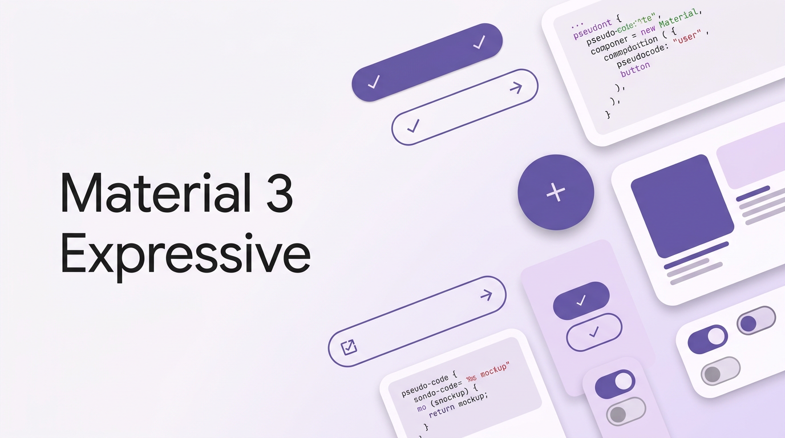

# Material Web Components Repository

A growing collection of reusable, framework-agnostic web components built with modern technologies. This monorepo leverages **Turborepo** and **PNPM Workspaces** to efficiently manage multiple web component packages.

[](LICENSE)
[](https://pnpm.io/)
[](https://turbo.build/repo)

## 🎨 Web Components

This repository contains a collection of web components that can be used in any JavaScript framework or vanilla JavaScript. Currently available:

- **[@banegasn/m3-badge](packages/m3-badge)** - Material Design 3 Badge component for counts and status indicators
- **[@banegasn/m3-button](packages/m3-button)** - Material Design 3 Button with 5 variants, 5 sizes, shape morphing, and loading states
- **[@banegasn/m3-card](packages/m3-card)** - Material Design 3 Card with 3 variants (Elevated, Filled, Outlined), media and action slots
- **[@banegasn/m3-checkbox](packages/m3-checkbox)** - Material Design 3 Checkbox with checked, unchecked, and indeterminate states
- **[@banegasn/m3-chip](packages/m3-chip)** - Material Design 3 Chip for filters, selections, and input tags
 - **[@banegasn/m3-dialog](packages/m3-dialog)** - Material Design 3 Dialog with expressive open/close animations
 - **[@banegasn/m3-divider](packages/m3-divider)** - Material Design 3 Divider with entrance animations and vertical support
 - **[@banegasn/m3-fab-menu](packages/m3-fab-menu)** - Material Design 3 FAB Menu for expressive floating action interactions
 - **[@banegasn/m3-icon-button](packages/m3-icon-button)** - Material Design 3 Icon Button with press animations and multiple variants
 - **[@banegasn/m3-list](packages/m3-list)** - Material Design 3 List and List Item with staggered entrance animations and multi-line support
 - **[@banegasn/m3-snackbar](packages/m3-snackbar)** - Material Design 3 Snackbar with entrance/exit animations and action support
 - **[@banegasn/m3-top-app-bar](packages/m3-top-app-bar)** - Material Design 3 Top App Bar with multiple size variants
- **[@banegasn/m3-loading-indicator](packages/m3-loading-indicator)** - Material Design 3 Loading Indicator with shape morphing animation
- **[@banegasn/m3-menu](packages/m3-menu)** - Material Design 3 Menu with smart positioning and keyboard navigation
- **[@banegasn/m3-navigation-bar](packages/m3-navigation-bar)** - Material Design 3 Navigation Bar with responsive layouts and badge support
- **[@banegasn/m3-navigation-rail](packages/m3-navigation-rail)** - Material Design 3 Navigation Rail with collapsible functionality and badges
- **[@banegasn/m3-progress](packages/m3-progress)** - Material Design 3 Linear Progress Indicator with determinate and indeterminate modes
- **[@banegasn/m3-radio-button](packages/m3-radio-button)** - Material Design 3 Radio Button for single-option selection from a group
- **[@banegasn/m3-search-bar](packages/m3-search-bar)** - Material Design 3 Search Bar with leading and trailing content slots
- **[@banegasn/m3-slider](packages/m3-slider)** - Material Design 3 Slider with continuous and discrete (stepped) modes
- **[@banegasn/m3-split-button](packages/m3-split-button)** - Material Design 3 Split Button with primary action and dropdown
- **[@banegasn/m3-switch](packages/m3-switch)** - Material Design 3 Switch for toggling between on and off states
- **[@banegasn/m3-tabs](packages/m3-tabs)** - Material Design 3 Tabs with animated indicator and icon support
- **[@banegasn/m3-text-field](packages/m3-text-field)** - Material Design 3 Text Field with filled and outlined variants
- **[@banegasn/m3-tooltip](packages/m3-tooltip)** - Material Design 3 Tooltip with plain and rich variants

## 📚 Documentation

- **[Publishing Guide](PUBLISHING.md)** - How to publish web component packages
- **[Web Components](#-web-components)** - List of available components
- **[Component Packages](#-demo-applications)** - Individual package documentation

## 🌐 Live Demo

The Angular demo app is automatically deployed to GitHub Pages:
**[https://banegasn.github.io/components/](https://banegasn.github.io/components/)**

Every push to the `main` branch triggers an automatic deployment.

## 🏗️ Architecture

This monorepo is designed for building and distributing web components:
- **Framework-agnostic components**: Built with Lit, Svelte, and other modern web component technologies
- **Universal compatibility**: Components work in any JavaScript framework (Angular, React, Vue, etc.) or vanilla JavaScript
- **Efficient builds**: Turborepo for intelligent build caching and parallelization
- **Workspace management**: PNPM for fast, disk-efficient dependency management
- **Demo applications**: Example apps showcasing component usage in different frameworks

## 📁 Project Structure

```
.
├── apps/
│   └── angular-app/          # Angular demo showcasing all web components
├── packages/
│   ├── m3-badge/
│   ├── m3-button/
│   ├── m3-card/
│   ├── m3-checkbox/
│   ├── m3-chip/
│   ├── m3-dialog/
│   ├── m3-divider/
│   ├── m3-fab-menu/
│   ├── m3-icon-button/
│   ├── m3-list/
│   ├── m3-loading-indicator/
│   ├── m3-menu/
│   ├── m3-navigation-bar/
│   ├── m3-navigation-rail/
│   ├── m3-progress/
│   ├── m3-radio-button/
│   ├── m3-search-bar/
│   ├── m3-slider/
│   ├── m3-snackbar/
│   ├── m3-split-button/
│   ├── m3-switch/
│   ├── m3-tabs/
│   ├── m3-text-field/
│   ├── m3-top-app-bar/
│   ├── m3-tooltip/
│   └── svelte-components/
├── scripts/                  # Build, publish, and screenshot utilities
├── pnpm-workspace.yaml
├── turbo.json
└── tsconfig.json
```

## 🚀 Quick Start

### Use via CDN (No build step)

You can use the components directly in any HTML file without installing anything by using the jsDelivr CDN and its ES module features:

```html
<!-- Import directly as a module -->
<script type="module" src="https://cdn.jsdelivr.net/npm/@banegasn/m3-button/+esm"></script>

<!-- Or import multiple components -->
<script type="module">
  import "https://cdn.jsdelivr.net/npm/@banegasn/m3-button/+esm";
  import "https://cdn.jsdelivr.net/npm/@banegasn/m3-card/+esm";
</script>

<!-- Use the components -->
<m3-button variant="filled">Click me</m3-button>
```

### Build from source / Install locally

#### Prerequisites

- **Node.js** >= 22.16.0
- **PNPM** >= 9.0.0

Install PNPM if you haven't already:
```bash
npm install -g pnpm@9.12.1
```

### Installation

```bash
# Clone the repository
git clone <repository-url>
cd components

# Install dependencies
pnpm install

# Build all packages and apps
pnpm build

# Run development servers
pnpm dev
```

## 🛠️ Development

### Build Commands

```bash
# Build all packages and apps
pnpm build

# Build specific package
pnpm --filter @banegasn/m3-button build

# Build specific app
pnpm --filter angular-app build
```

### Development Commands

```bash
# Run all dev servers
pnpm dev

# Run specific package in dev mode
cd packages/example-component
pnpm dev

# Run specific app
cd apps/angular-app
pnpm dev
```

The Angular app will be available at `http://localhost:4200`

### Other Commands

```bash
# Run linters
pnpm lint

# Run tests
pnpm test

# Clean all build artifacts
pnpm clean
```

## 🎯 Demo Applications

### angular-app

A demonstration Angular application showcasing how to use the web components in a real-world application.

**Features:**
- Angular 20 with standalone components
- Live examples of all available web components
- Integration patterns and best practices
- Deployed to GitHub Pages for live preview

**Run:**
```bash
cd apps/angular-app
pnpm dev
```

> 💡 **Note:** More demo apps (React, Vue, vanilla JS) may be added in the future to demonstrate cross-framework compatibility.

## 🔧 Turborepo Configuration

The `turbo.json` file defines the build pipeline:

- **build**: Builds all packages with dependency awareness
- **dev**: Runs all development servers
- **lint**: Runs linters across the monorepo
- **test**: Runs tests with proper dependencies
- **clean**: Cleans build artifacts

### Key Features:
- **Caching**: Turborepo caches build outputs for faster rebuilds
- **Parallelization**: Runs independent tasks in parallel
- **Dependency graph**: Ensures packages build in the correct order

## 📝 Adding New Web Components

### Add a new component package:

1. Create package directory:
```bash
mkdir -p packages/my-web-component/src
```

2. Create `package.json`:
```json
{
  "name": "@banegasn/my-web-component",
  "version": "1.0.0",
  "type": "module",
  "main": "./dist/index.js",
  "types": "./dist/index.d.ts",
  "scripts": {
    "build": "tsc",
    "dev": "tsc --watch"
  }
}
```

3. Create your web component using Lit, Svelte, or vanilla JavaScript

4. Install dependencies from root:
```bash
pnpm install
```

### Add a new demo app:

1. Create app directory:
```bash
mkdir -p apps/my-demo-app
```

2. Set up your framework (React, Vue, etc.)

3. Add workspace dependencies in `package.json`:
```json
{
  "dependencies": {
    "@banegasn/m3-button": "workspace:*",
    "@banegasn/m3-card": "workspace:*",
    "@banegasn/m3-navigation-bar": "workspace:*",
    "@banegasn/m3-navigation-rail": "workspace:*",
    "@banegasn/m3-switch": "workspace:*",
    "@banegasn/m3-radio-button": "workspace:*",
    "@banegasn/m3-search-bar": "workspace:*",
    "@banegasn/m3-fab-menu": "workspace:*",
    "@banegasn/m3-loading-indicator": "workspace:*",
    "@banegasn/m3-menu": "workspace:*",
    "@banegasn/m3-split-button": "workspace:*"
  }
}
```

## 🧪 Testing

Add test scripts to individual packages:

```json
{
  "scripts": {
    "test": "vitest"
  }
}
```

Run all tests:
```bash
pnpm test
```

## 🚢 Building for Production

### Build all packages and apps:
```bash
pnpm build
```

Turborepo will:
1. Build packages in dependency order
2. Cache successful builds
3. Only rebuild what changed

### Build for GitHub Pages:
```bash
pnpm build:gh-pages
```

This builds all packages and the Angular app optimized for GitHub Pages deployment with the correct base href (`/components/`).

## 📤 Publishing Web Components

To publish web component packages to GitHub Packages (or npm):

```bash
# Bump version
pnpm version:patch  # or version:minor, version:major

# Publish to npm
pnpm publish:npm

# Publish to GitHub Packages
pnpm publish:github
```

All web components are published as individual npm packages that can be installed and used in any project.

See [PUBLISHING.md](PUBLISHING.md) for detailed publishing instructions and GitHub Actions setup.

## 📚 Best Practices for Web Components

1. **Framework-agnostic**: Design components to work in any framework or vanilla JavaScript
2. **Use workspace protocol**: Reference workspace packages with `workspace:*`
3. **Shared configs**: Extend root `tsconfig.json` for consistency
4. **Custom elements**: Follow web component standards and naming conventions (kebab-case)
5. **Semantic versioning**: Version packages independently
6. **Documentation**: Keep README files updated in each package with usage examples
7. **Accessibility**: Ensure components follow WCAG guidelines and support keyboard navigation

## 🔍 Troubleshooting

### Clear all caches:
```bash
pnpm clean
rm -rf node_modules pnpm-lock.yaml
pnpm install
```

### Clear Turborepo cache:
```bash
rm -rf .turbo
```

### Reinstall dependencies:
```bash
pnpm install --force
```

## 📖 Resources

### Web Components
- [Web Components Standards](https://developer.mozilla.org/en-US/docs/Web/Web_Components)
- [Lit Documentation](https://lit.dev/)
- [Svelte Documentation](https://svelte.dev/)
- [Material Design 3](https://m3.material.io/)

### Monorepo Tools
- [Turborepo Documentation](https://turbo.build/repo/docs)
- [PNPM Workspaces](https://pnpm.io/workspaces)

### Framework Integration
- [Angular Documentation](https://angular.dev/)
- [Using Web Components in React](https://react.dev/reference/react-dom/components#custom-html-elements)
- [Using Web Components in Vue](https://vuejs.org/guide/extras/web-components.html)

## 🤝 Contributing

1. Create a new branch
2. Make your changes
3. Run `pnpm build` and `pnpm test`
4. Submit a pull request

## 📄 License

MIT
