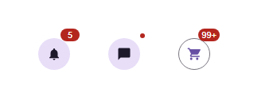

# @banegasn/m3-badge




> Material Design 3 Badge web component — framework-agnostic, built with Lit.

[](https://www.npmjs.com/package/@banegasn/m3-badge)
[](../../LICENSE)

A lightweight, accessible **M3 Badge** web component that follows the [Material Design 3 badge specifications](https://m3.material.io/components/badges/overview). Works in any framework — Angular, React, Vue, Svelte — or plain HTML with no build step required.

## Features

- Small dot badge and large label badge variants
- Works standalone or overlaid on icons and navigation items
- Fully accessible with ARIA support
- Zero dependencies beyond Lit
- Framework-agnostic custom element

## Installation

```bash
npm install @banegasn/m3-badge
# or
pnpm add @banegasn/m3-badge
# or
yarn add @banegasn/m3-badge
```

## CDN Usage (no build step)

Drop it straight into any HTML file via jsDelivr:

```html
<!DOCTYPE html>
<html lang="en">
<head>
  <meta charset="UTF-8" />
  <title>M3 Badge Demo</title>
  <script type="module" src="https://cdn.jsdelivr.net/npm/@banegasn/m3-badge/+esm"></script>
  <script type="module" src="https://cdn.jsdelivr.net/npm/@banegasn/m3-button/+esm"></script>
  <style>
    body { font-family: Roboto, sans-serif; padding: 32px; background: #fef7ff; display: flex; gap: 48px; align-items: center; min-width: 300px }
    .icon-wrap { position: relative; display: inline-flex; }
  </style>
</head>
<body>
  <!-- Badge on a button -->
  <div class="icon-wrap">
    <m3-button variant="tonal" icon-only aria-label="Notifications">
      <svg slot="icon" viewBox="0 0 24 24" width="20" height="20">
        <path fill="currentColor" d="M12 22c1.1 0 2-.9 2-2h-4c0 1.1.9 2 2 2zm6-6v-5c0-3.07-1.64-5.64-4.5-6.32V4c0-.83-.67-1.5-1.5-1.5s-1.5.67-1.5 1.5v.68C7.63 5.36 6 7.92 6 11v5l-2 2v1h16v-1l-2-2z"/>
      </svg>
    </m3-button>
    <m3-badge label="5" style="position:absolute;top:-4px;right:-4px;"></m3-badge>
  </div>

  <!-- Dot badge on a button -->
  <div class="icon-wrap">
    <m3-button variant="tonal" icon-only aria-label="Messages">
      <svg slot="icon" viewBox="0 0 24 24" width="20" height="20">
        <path fill="currentColor" d="M20 2H4c-1.1 0-2 .9-2 2v18l4-4h14c1.1 0 2-.9 2-2V4c0-1.1-.9-2-2-2z"/>
      </svg>
    </m3-button>
    <m3-badge style="position:absolute;top:-2px;right:-2px;"></m3-badge>
  </div>

  <!-- Large count badge -->
  <div class="icon-wrap">
    <m3-button variant="outlined" icon-only aria-label="Cart">
      <svg slot="icon" viewBox="0 0 24 24" width="20" height="20">
        <path fill="currentColor" d="M7 18c-1.1 0-2 .9-2 2s.9 2 2 2 2-.9 2-2-.9-2-2-2zm10 0c-1.1 0-2 .9-2 2s.9 2 2 2 2-.9 2-2-.9-2-2-2zM7.2 14.8l.03-.12.97-1.68H17c.75 0 1.41-.41 1.75-1.03l3.58-6.49A1 1 0 0 0 21.46 4H5.21l-.94-2H1v2h2l3.6 7.59L5.25 14c-.16.28-.25.61-.25.96C5 16.1 5.9 17 7 17h14v-2H7.42c-.13 0-.22-.11-.22-.2z"/>
      </svg>
    </m3-button>
    <m3-badge label="99+" style="position:absolute;top:-4px;right:-4px;"></m3-badge>
  </div>
</body>
</html>
```
</body>
</html>
```

## npm Usage

```js
import '@banegasn/m3-badge';
```

```html
<m3-badge></m3-badge>
<m3-badge label="3"></m3-badge>
<m3-badge label="99+"></m3-badge>
```

## API

### Properties

| Property | Type | Default | Description |
|----------|------|---------|-------------|
| `label` | `string` | `''` | Badge text. Empty string renders a small dot badge. |

### CSS Custom Properties

| Property | Default | Description |
|----------|---------|-------------|
| `--md-sys-color-error` | `#ba1a1a` | Badge background color |
| `--md-sys-color-on-error` | `#ffffff` | Badge text color |

## Framework Usage

### Angular
```typescript
import '@banegasn/m3-badge';
// template:
// <m3-badge label="3"></m3-badge>
```

### React
```jsx
import '@banegasn/m3-badge';
// <m3-badge label="3" />
```

### Vue
```vue
<script setup>
import '@banegasn/m3-badge';
</script>
<template>
  <m3-badge label="3" />
</template>
```

## Related Packages

- [@banegasn/m3-navigation-bar](https://www.npmjs.com/package/@banegasn/m3-navigation-bar)
- [@banegasn/m3-navigation-rail](https://www.npmjs.com/package/@banegasn/m3-navigation-rail)

## Resources

- [Material Design 3 Badges](https://m3.material.io/components/badges/overview)
- [GitHub Repository](https://github.com/banegasn/components)

## License

MIT
