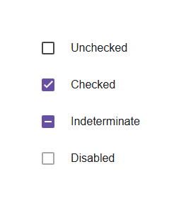

# @banegasn/m3-checkbox




> Material Design 3 Checkbox web component — framework-agnostic, built with Lit.

[](https://www.npmjs.com/package/@banegasn/m3-checkbox)
[](../../LICENSE)

An accessible **M3 Checkbox** web component following the [Material Design 3 checkbox specifications](https://m3.material.io/components/checkbox/overview). Supports checked, unchecked, and indeterminate states with expressive animations. Works in Angular, React, Vue, Svelte, or plain HTML — no build step required.

## Features

- Checked, unchecked, and indeterminate states
- Expressive M3 animations
- Disabled state support
- Accessible with ARIA `checkbox` role
- Keyboard navigation (Space key)
- Framework-agnostic custom element

## Installation

```bash
npm install @banegasn/m3-checkbox
# or
pnpm add @banegasn/m3-checkbox
# or
yarn add @banegasn/m3-checkbox
```

## CDN Usage (no build step)

```html
<!DOCTYPE html>
<html lang="en">
<head>
  <meta charset="UTF-8" />
  <title>M3 Checkbox Demo</title>
  <script type="module" src="https://cdn.jsdelivr.net/npm/@banegasn/m3-checkbox/+esm"></script>
  <style>
    body { font-family: Roboto, sans-serif; padding: 16px; background: #fef7ff; }
    .row { display: flex; align-items: center; gap: 12px; margin-bottom: 12px; }
    label { font-size: 16px; color: #1d1b20; cursor: pointer; }
  </style>
</head>
<body>
  <div class="row">
    <m3-checkbox id="cb1"></m3-checkbox>
    <label for="cb1">Unchecked</label>
  </div>
  <div class="row">
    <m3-checkbox id="cb2" checked></m3-checkbox>
    <label for="cb2">Checked</label>
  </div>
  <div class="row">
    <m3-checkbox id="cb3" indeterminate></m3-checkbox>
    <label for="cb3">Indeterminate</label>
  </div>
  <div class="row">
    <m3-checkbox id="cb4" disabled></m3-checkbox>
    <label for="cb4">Disabled</label>
  </div>

  <script>
    document.querySelectorAll('m3-checkbox').forEach(cb => {
      cb.addEventListener('checkbox-change', (e) => {
        console.log('Checkbox changed:', e.detail);
      });
    });
  </script>
</body>
</html>
```

## npm Usage

```js
import '@banegasn/m3-checkbox';
```

```html
<m3-checkbox></m3-checkbox>
<m3-checkbox checked></m3-checkbox>
<m3-checkbox indeterminate></m3-checkbox>
<m3-checkbox disabled></m3-checkbox>
```

## API

### Properties

| Property | Type | Default | Description |
|----------|------|---------|-------------|
| `checked` | `boolean` | `false` | Whether the checkbox is checked |
| `indeterminate` | `boolean` | `false` | Whether the checkbox is in an indeterminate state |
| `disabled` | `boolean` | `false` | Disables the checkbox |
| `name` | `string \| null` | `null` | Name for form submission |
| `value` | `string \| null` | `null` | Value for form submission |
| `aria-label` | `string \| null` | `null` | ARIA label for accessibility |

### Events

| Event | Detail | Description |
|-------|--------|-------------|
| `checkbox-change` | `{ checked: boolean, indeterminate: boolean, name: string \| null, value: string \| null }` | Fired when the checkbox state changes |

### CSS Custom Properties

| Property | Default | Description |
|----------|---------|-------------|
| `--md-sys-color-primary` | `#6750a4` | Checked state color |
| `--md-sys-color-on-primary` | `#ffffff` | Checkmark color |
| `--md-sys-color-on-surface` | `#1d1b20` | Unchecked border color |

## Framework Usage

### Angular
```typescript
import '@banegasn/m3-checkbox';
```
```html
<m3-checkbox [checked]="isChecked" (checkbox-change)="onCheckboxChange($event)"></m3-checkbox>
```

### React
```jsx
import '@banegasn/m3-checkbox';
// <m3-checkbox checked={isChecked} oncheckbox-change={handleChange} />
```

### Vue
```vue
<m3-checkbox :checked="isChecked" @checkbox-change="handleChange" />
```

## Resources

- [Material Design 3 Checkbox](https://m3.material.io/components/checkbox/overview)
- [GitHub Repository](https://github.com/banegasn/components)

## License

MIT
