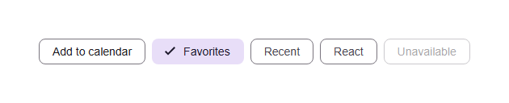

# @banegasn/m3-chip




> Material Design 3 Chip web component — framework-agnostic, built with Lit.

[](https://www.npmjs.com/package/@banegasn/m3-chip)
[](../../LICENSE)

A compact, accessible **M3 Chip** web component following the [Material Design 3 chip specifications](https://m3.material.io/components/chips/overview). Use chips for filters, selections, actions, and input tags. Works in Angular, React, Vue, Svelte, or plain HTML — no build step required.

## Features

- Assist, filter, input, and suggestion chip variants
- Selected and disabled states
- Optional leading icon slot
- Keyboard accessible
- Framework-agnostic custom element

## Installation

```bash
npm install @banegasn/m3-chip
# or
pnpm add @banegasn/m3-chip
# or
yarn add @banegasn/m3-chip
```

## CDN Usage (no build step)

```html
<!DOCTYPE html>
<html lang="en">
<head>
  <meta charset="UTF-8" />
  <title>M3 Chip Demo</title>
  <script type="module" src="https://cdn.jsdelivr.net/npm/@banegasn/m3-chip/+esm"></script>
  <style>
    body { font-family: Roboto, sans-serif; padding: 32px; background: #fef7ff; }
    .chip-row { display: flex; gap: 8px; flex-wrap: wrap; }
  </style>
</head>
<body>
  <div class="chip-row">
    <!-- Assist chip -->
    <m3-chip>Add to calendar</m3-chip>

    <!-- Filter chip (selected) -->
    <m3-chip variant="filter" selected>Favorites</m3-chip>

    <!-- Filter chip -->
    <m3-chip variant="filter">Recent</m3-chip>

    <!-- Input chip -->
    <m3-chip variant="input">React</m3-chip>

    <!-- Disabled chip -->
    <m3-chip disabled>Unavailable</m3-chip>
  </div>

  <script>
    document.querySelectorAll('m3-chip').forEach(chip => {
      chip.addEventListener('chip-click', (e) => {
        console.log('Chip clicked:', e.detail);
      });
    });
  </script>
</body>
</html>
```

## npm Usage

```js
import '@banegasn/m3-chip';
```

```html
<m3-chip>Assist</m3-chip>
<m3-chip variant="filter" selected>Filter</m3-chip>
<m3-chip variant="input">Input</m3-chip>
<m3-chip variant="suggestion">Suggestion</m3-chip>
<m3-chip disabled>Disabled</m3-chip>
```

## With Icon

```html
<m3-chip>
  <svg slot="icon" viewBox="0 0 24 24" width="18" height="18">
    <path fill="currentColor" d="M12 2C6.48 2 2 6.48 2 12s4.48 10 10 10 10-4.48 10-10S17.52 2 12 2zm-2 14.5v-9l6 4.5-6 4.5z"/>
  </svg>
  Play
</m3-chip>
```

## API

### Properties

| Property | Type | Default | Description |
|----------|------|---------|-------------|
| `variant` | `'assist' \| 'filter' \| 'input' \| 'suggestion'` | `'assist'` | Chip style variant |
| `selected` | `boolean` | `false` | Whether the chip is selected (filter chips) |
| `disabled` | `boolean` | `false` | Disables the chip |

### Events

| Event | Detail | Description |
|-------|--------|-------------|
| `chip-click` | `{ selected: boolean }` | Fired when the chip is clicked |

### Slots

| Slot | Description |
|------|-------------|
| (default) | Chip label text |
| `icon` | Optional leading icon |

### CSS Custom Properties

| Property | Default | Description |
|----------|---------|-------------|
| `--md-sys-color-primary` | `#6750a4` | Selected chip color |
| `--md-sys-color-on-surface` | `#1d1b20` | Default chip text color |
| `--md-sys-color-outline` | `#79747e` | Chip border color |

## Framework Usage

### Angular
```typescript
import '@banegasn/m3-chip';
```
```html
<m3-chip variant="filter" [selected]="isSelected" (chip-click)="onChipClick($event)">
  Filter
</m3-chip>
```

### React
```jsx
import '@banegasn/m3-chip';
// <m3-chip variant="filter" selected={isSelected} onchip-click={handleClick}>Filter</m3-chip>
```

### Vue
```vue
<m3-chip variant="filter" :selected="isSelected" @chip-click="handleClick">Filter</m3-chip>
```

## Resources

- [Material Design 3 Chips](https://m3.material.io/components/chips/overview)
- [GitHub Repository](https://github.com/banegasn/components)

## License

MIT
