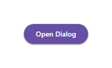

# @banegasn/m3-dialog




> Material Design 3 Dialog web component — framework-agnostic, built with Lit.

[](https://www.npmjs.com/package/@banegasn/m3-dialog)
[](../../LICENSE)

An accessible **M3 Dialog** web component following the [Material Design 3 dialog specifications](https://m3.material.io/components/dialogs/overview). Features expressive open/close animations, headline, content, and action slots. Works in Angular, React, Vue, Svelte, or plain HTML — no build step required.

## Features

- Basic and full-screen dialog variants
- Expressive open/close animations
- Headline, content, and actions slots
- Focus trap and scroll lock when open
- Keyboard accessible (Escape to close)
- Accessible with ARIA `dialog` role
- Framework-agnostic custom element

## Installation

```bash
npm install @banegasn/m3-dialog
# or
pnpm add @banegasn/m3-dialog
# or
yarn add @banegasn/m3-dialog
```

## CDN Usage (no build step)

```html
<!DOCTYPE html>
<html lang="en">
<head>
  <meta charset="UTF-8" />
  <title>M3 Dialog Demo</title>
  <script type="module" src="https://cdn.jsdelivr.net/npm/@banegasn/m3-dialog/+esm"></script>
  <script type="module" src="https://cdn.jsdelivr.net/npm/@banegasn/m3-button/+esm"></script>
  <style>
    body { font-family: Roboto, sans-serif; padding: 32px; background: #fef7ff; }
  </style>
</head>
<body>
  <m3-button id="open-btn" variant="filled">Open Dialog</m3-button>

  <m3-dialog id="my-dialog" headline="Confirm action">
    <p>Are you sure you want to delete this item? This action cannot be undone.</p>
    <m3-button slot="actions" variant="text" id="cancel-btn">Cancel</m3-button>
    <m3-button slot="actions" variant="filled" id="confirm-btn">Delete</m3-button>
  </m3-dialog>

  <script>
    const dialog = document.getElementById('my-dialog');
    document.getElementById('open-btn').addEventListener('button-click', () => dialog.open = true);
    document.getElementById('cancel-btn').addEventListener('button-click', () => dialog.open = false);
    document.getElementById('confirm-btn').addEventListener('button-click', () => {
      console.log('Confirmed!');
      dialog.open = false;
    });
  </script>
</body>
</html>
```

## npm Usage

```js
import '@banegasn/m3-dialog';
```

```html
<m3-dialog open headline="Dialog Title">
  <p>Dialog content goes here.</p>
  <m3-button slot="actions" variant="text">Cancel</m3-button>
  <m3-button slot="actions" variant="filled">Confirm</m3-button>
</m3-dialog>
```

## API

### Properties

| Property | Type | Default | Description |
|----------|------|---------|-------------|
| `open` | `boolean` | `false` | Whether the dialog is open |
| `headline` | `string` | `''` | Dialog title text |

### Events

| Event | Detail | Description |
|-------|--------|-------------|
| `dialog-close` | `{}` | Fired when the dialog is closed |

### Slots

| Slot | Description |
|------|-------------|
| (default) | Dialog body content |
| `actions` | Action buttons (displayed at the bottom) |

### CSS Custom Properties

| Property | Default | Description |
|----------|---------|-------------|
| `--md-sys-color-surface-container-high` | `#ece6f0` | Dialog background |
| `--md-sys-color-on-surface` | `#1d1b20` | Dialog text color |
| `--md-dialog-container-shape` | `28px` | Dialog border radius |

## Framework Usage

### Angular
```typescript
import '@banegasn/m3-dialog';
```
```html
<m3-dialog [open]="isOpen" headline="Confirm" (dialog-close)="isOpen = false">
  <p>Are you sure?</p>
  <m3-button slot="actions" variant="text" (button-click)="isOpen = false">Cancel</m3-button>
  <m3-button slot="actions" variant="filled" (button-click)="confirm()">OK</m3-button>
</m3-dialog>
```

### React
```jsx
import '@banegasn/m3-dialog';
// <m3-dialog open={isOpen} headline="Confirm" ondialog-close={() => setOpen(false)}>...</m3-dialog>
```

### Vue
```vue
<m3-dialog :open="isOpen" headline="Confirm" @dialog-close="isOpen = false">
  <p>Are you sure?</p>
  <m3-button slot="actions" variant="text" @button-click="isOpen = false">Cancel</m3-button>
  <m3-button slot="actions" variant="filled" @button-click="confirm">OK</m3-button>
</m3-dialog>
```

## Resources

- [Material Design 3 Dialogs](https://m3.material.io/components/dialogs/overview)
- [GitHub Repository](https://github.com/banegasn/components)

## License

MIT
