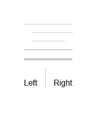

# @banegasn/m3-divider



Material Design 3 Divider web component with expressive entrance animations.

## Features

- **Variants**: `full-width`, `inset`, `middle`
- **Orientations**: `horizontal`, `vertical`
- **Thickness**: `1`, `2`, `4` pixels
- **Expressive animations**: Smooth scale entrance animation with customizable easing
- **Pulsing mode**: Subtle pulse animation for loading/placeholder states
- **Accessible**: Proper ARIA `separator` role and `aria-orientation`

## Installation

```bash
npm install @banegasn/m3-divider
```

## Usage

```html
<script type="module">
  import '@banegasn/m3-divider';
</script>

<!-- Full-width divider (default) -->
<m3-divider></m3-divider>

<!-- Inset divider (useful in lists) -->
<m3-divider variant="inset"></m3-divider>

<!-- Middle divider (indented both sides) -->
<m3-divider variant="middle"></m3-divider>

<!-- Vertical divider -->
<m3-divider orientation="vertical"></m3-divider>

<!-- Thicker divider -->
<m3-divider thickness="2"></m3-divider>

<!-- Disable animation -->
<m3-divider no-animation></m3-divider>

<!-- Pulsing for loading states -->
<m3-divider pulsing></m3-divider>
```

## CDN Usage (no build step)

```html
<!DOCTYPE html>
<html lang="en">
<head>
  <meta charset="UTF-8" />
  <title>M3 Divider Demo</title>
  <link rel="stylesheet" href="https://fonts.googleapis.com/css2?family=Material+Symbols+Outlined:opsz,wght,FILL,GRAD@24,400,0,0" />
  <script type="module" src="https://cdn.jsdelivr.net/npm/@banegasn/m3-divider/+esm"></script>
  <style>
    body { font-family: Roboto, sans-serif; padding: 32px; background: #fef7ff; }
    .col { display: flex; flex-direction: column; gap: 16px; max-width: 400px; }
    .row { display: flex; gap: 16px; align-items: center; height: 60px; }
  </style>
</head>
<body>
  <div class="col">
    <m3-divider></m3-divider>
    <m3-divider variant="inset"></m3-divider>
    <m3-divider variant="middle"></m3-divider>
    <m3-divider thickness="2"></m3-divider>
    <m3-divider thickness="4" pulsing></m3-divider>
    <div class="row">
      <span>Left</span>
      <m3-divider orientation="vertical" style="height:40px;"></m3-divider>
      <span>Right</span>
    </div>
  </div>
</body>
</html>
```

## Customization

```css
m3-divider {
  --md-sys-color-outline-variant: #e0e0e0;
  --_animation-duration: 0.3s;
  --_inset-start: 24px;
}
```

## License

MIT
