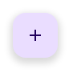

# @banegasn/m3-fab-menu




> Material Design 3 FAB Menu web component — framework-agnostic, built with Lit.

[](https://www.npmjs.com/package/@banegasn/m3-fab-menu)
[](../../LICENSE)

An expressive **M3 FAB Menu** (Floating Action Button Menu) web component — a modern replacement for the speed dial pattern. Features smooth open/close animations and a slotted menu item system. Works in Angular, React, Vue, Svelte, or plain HTML — no build step required.

## Features

- Expressive open/close animations
- Slotted FAB trigger and menu items
- Keyboard accessible (Escape to close)
- Click-outside to dismiss
- Framework-agnostic custom element

## Installation

```bash
npm install @banegasn/m3-fab-menu
# or
pnpm add @banegasn/m3-fab-menu
# or
yarn add @banegasn/m3-fab-menu
```

## CDN Usage (no build step)

```html
<!DOCTYPE html>
<html lang="en">
<head>
  <meta charset="UTF-8" />
  <title>M3 FAB Menu Demo</title>
  <script type="module" src="https://cdn.jsdelivr.net/npm/@banegasn/m3-fab-menu/+esm"></script>
  <style>
    body { font-family: Roboto, sans-serif; background: #fef7ff;  }
    .fab-container { position: fixed; bottom: 24px; right: 24px; }
  </style>
</head>
<body>
  <div class="fab-container">
    <m3-fab-menu>
      <m3-fab-menu-item label="New document">
        <svg slot="icon" viewBox="0 0 24 24" width="24" height="24">
          <path fill="currentColor" d="M14 2H6c-1.1 0-2 .9-2 2v16c0 1.1.9 2 2 2h12c1.1 0 2-.9 2-2V8l-6-6zm2 16H8v-2h8v2zm0-4H8v-2h8v2zm-3-5V3.5L18.5 9H13z"/>
        </svg>
      </m3-fab-menu-item>
      <m3-fab-menu-item label="Upload file">
        <svg slot="icon" viewBox="0 0 24 24" width="24" height="24">
          <path fill="currentColor" d="M9 16h6v-6h4l-7-7-7 7h4zm-4 2h14v2H5z"/>
        </svg>
      </m3-fab-menu-item>
      <m3-fab-menu-item label="New folder">
        <svg slot="icon" viewBox="0 0 24 24" width="24" height="24">
          <path fill="currentColor" d="M20 6h-8l-2-2H4c-1.11 0-2 .89-2 2v12c0 1.11.89 2 2 2h16c1.11 0 2-.89 2-2V8c0-1.11-.89-2-2-2zm-1 8h-3v3h-2v-3h-3v-2h3V9h2v3h3v2z"/>
        </svg>
      </m3-fab-menu-item>
    </m3-fab-menu>
  </div>

  <script>
    document.querySelector('m3-fab-menu').addEventListener('fab-menu-item-click', (e) => {
      console.log('Selected:', e.detail.label);
    });
  </script>
</body>
</html>
```

## npm Usage

```js
import '@banegasn/m3-fab-menu';
```

```html
<m3-fab-menu>
  <m3-fab-menu-item label="New document">
    <!-- icon slot -->
  </m3-fab-menu-item>
  <m3-fab-menu-item label="Upload">
    <!-- icon slot -->
  </m3-fab-menu-item>
</m3-fab-menu>
```

## API

### `m3-fab-menu` Properties

| Property | Type | Default | Description |
|----------|------|---------|-------------|
| `open` | `boolean` | `false` | Whether the menu is open |

### `m3-fab-menu` Events

| Event | Detail | Description |
|-------|--------|-------------|
| `fab-menu-open` | `{}` | Fired when the menu opens |
| `fab-menu-close` | `{}` | Fired when the menu closes |
| `fab-menu-item-click` | `{ label: string }` | Fired when a menu item is clicked |

### `m3-fab-menu-item` Properties

| Property | Type | Default | Description |
|----------|------|---------|-------------|
| `label` | `string` | `''` | Item label text |
| `disabled` | `boolean` | `false` | Disables the item |

### Slots

| Slot | Description |
|------|-------------|
| (default) | `m3-fab-menu-item` elements |
| `icon` (on item) | Icon for each menu item |

### CSS Custom Properties

| Property | Default | Description |
|----------|---------|-------------|
| `--md-sys-color-primary-container` | `#eaddff` | FAB background color |
| `--md-sys-color-on-primary-container` | `#21005d` | FAB icon color |
| `--md-sys-color-surface-container-high` | `#ece6f0` | Menu item background |

## Framework Usage

### Angular
```typescript
import '@banegasn/m3-fab-menu';
```
```html
<m3-fab-menu (fab-menu-item-click)="onItemClick($event)">
  <m3-fab-menu-item label="New"></m3-fab-menu-item>
</m3-fab-menu>
```

### React
```jsx
import '@banegasn/m3-fab-menu';
// <m3-fab-menu onfab-menu-item-click={handleClick}>...</m3-fab-menu>
```

### Vue
```vue
<m3-fab-menu @fab-menu-item-click="handleClick">
  <m3-fab-menu-item label="New" />
</m3-fab-menu>
```

## Resources

- [Material Design 3 FAB](https://m3.material.io/components/floating-action-button/overview)
- [GitHub Repository](https://github.com/banegasn/components)

## License

MIT
