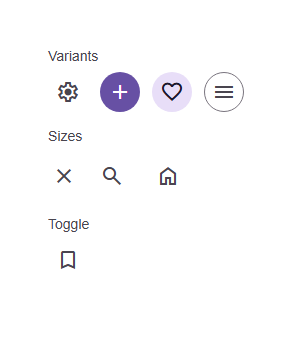

# @banegasn/m3-icon-button



Material Design 3 Icon Button web component with expressive press animations.

## Features

- **Variants**: `standard`, `filled`, `tonal`, `outlined`
- **Sizes**: `small` (32px), `medium` (40px), `large` (48px)
- **Toggle mode**: Click to toggle selected state with smooth color transitions
- **Press animation**: Subtle scale-down on press for tactile feedback
- **State layer**: Hover and focus feedback following M3 specs
- **Accessibility**: Proper ARIA labels and keyboard support

## Installation

```bash
npm install @banegasn/m3-icon-button
```

## Usage

```html
<script type="module">
  import '@banegasn/m3-icon-button';
</script>

<!-- Standard -->
<m3-icon-button aria-label="Settings">
  <span class="material-symbols-outlined">settings</span>
</m3-icon-button>

<!-- Filled -->
<m3-icon-button variant="filled" aria-label="Add">
  <span class="material-symbols-outlined">add</span>
</m3-icon-button>

<!-- Tonal -->
<m3-icon-button variant="tonal" aria-label="Favorite">
  <span class="material-symbols-outlined">favorite</span>
</m3-icon-button>

<!-- Outlined -->
<m3-icon-button variant="outlined" aria-label="Menu">
  <span class="material-symbols-outlined">menu</span>
</m3-icon-button>

<!-- Toggle -->
<m3-icon-button toggle aria-label="Bookmark">
  <span class="material-symbols-outlined">bookmark</span>
</m3-icon-button>

<!-- Small size -->
<m3-icon-button size="small" aria-label="Close">
  <span class="material-symbols-outlined">close</span>
</m3-icon-button>
```

## CDN Usage (no build step)

```html
<!DOCTYPE html>
<html lang="en">
<head>
  <meta charset="UTF-8" />
  <title>M3 Icon Button Demo</title>
  <link rel="stylesheet" href="https://fonts.googleapis.com/css2?family=Material+Symbols+Outlined:opsz,wght,FILL,GRAD@24,400,0,0" />
  <script type="module" src="https://cdn.jsdelivr.net/npm/@banegasn/m3-icon-button/+esm"></script>
  <style>
    body { font-family: Roboto, sans-serif; padding: 32px; background: #fef7ff; }
    .row { display: flex; gap: 12px; flex-wrap: wrap; align-items: center; margin-bottom: 16px; }
    .label { font-size: 14px; color: #49454f; margin-bottom: 8px; }
  </style>
</head>
<body>
  <div class="label">Variants</div>
  <div class="row">
    <m3-icon-button aria-label="Settings"><span class="material-symbols-outlined">settings</span></m3-icon-button>
    <m3-icon-button variant="filled" aria-label="Add"><span class="material-symbols-outlined">add</span></m3-icon-button>
    <m3-icon-button variant="tonal" aria-label="Favorite"><span class="material-symbols-outlined">favorite</span></m3-icon-button>
    <m3-icon-button variant="outlined" aria-label="Menu"><span class="material-symbols-outlined">menu</span></m3-icon-button>
  </div>
  <div class="label">Sizes</div>
  <div class="row">
    <m3-icon-button size="small" aria-label="Close"><span class="material-symbols-outlined">close</span></m3-icon-button>
    <m3-icon-button aria-label="Search"><span class="material-symbols-outlined">search</span></m3-icon-button>
    <m3-icon-button size="large" aria-label="Home"><span class="material-symbols-outlined">home</span></m3-icon-button>
  </div>
  <div class="label">Toggle</div>
  <div class="row">
    <m3-icon-button toggle aria-label="Bookmark"><span class="material-symbols-outlined">bookmark</span></m3-icon-button>
  </div>
</body>
</html>
```

## Events

- `icon-button-click` - Fired when the button is clicked
- `icon-button-toggle` - Fired when toggle mode changes selected state

## License

MIT
