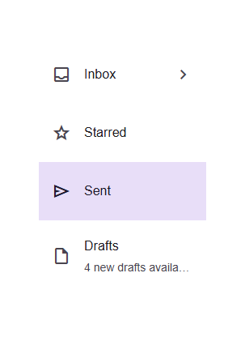

# @banegasn/m3-list



Material Design 3 List and List Item web components with expressive interactions.

## Features

- **List container**: `m3-list` with optional staggered entrance animations
- **List items**: `m3-list-item` supporting one, two, or three lines of text
- **Slots**: `leading` (icon/avatar), `trailing` (action/icon), `supporting-text`, `tertiary-text`
- **Selection state**: Visual feedback with smooth transitions
- **Keyboard navigation**: Full Enter/Space key support
- **Shape variants**: `default`, `rounded`, `full`
- **Accessibility**: Proper ARIA roles and attributes

## Installation

```bash
npm install @banegasn/m3-list
```

## Usage

```html
<script type="module">
  import '@banegasn/m3-list';
</script>

<!-- Simple list -->
<m3-list>
  <m3-list-item>Item One</m3-list-item>
  <m3-list-item>Item Two</m3-list-item>
  <m3-list-item>Item Three</m3-list-item>
</m3-list>

<!-- Staggered entrance animation -->
<m3-list staggered>
  <m3-list-item>Animated 1</m3-list-item>
  <m3-list-item>Animated 2</m3-list-item>
  <m3-list-item>Animated 3</m3-list-item>
</m3-list>

<!-- Two-line with leading icon -->
<m3-list-item lines="2">
  <span slot="leading" class="material-symbols-outlined">person</span>
  Headline Text
  <span slot="supporting-text">Supporting text goes here</span>
</m3-list-item>

<!-- Selected item -->
<m3-list-item selected>Selected Item</m3-list-item>

<!-- Rounded shape -->
<m3-list-item shape="rounded">Rounded Item</m3-list-item>
```

## CDN Usage (no build step)

```html
<!DOCTYPE html>
<html lang="en">
<head>
  <meta charset="UTF-8" />
  <title>M3 List Demo</title>
  <link rel="stylesheet" href="https://fonts.googleapis.com/css2?family=Material+Symbols+Outlined:opsz,wght,FILL,GRAD@24,400,0,0" />
  <script type="module" src="https://cdn.jsdelivr.net/npm/@banegasn/m3-list/+esm"></script>
  <style>
    body { font-family: Roboto, sans-serif; padding: 32px; background: #fef7ff; max-width: 400px; }
  </style>
</head>
<body>
  <m3-list>
    <m3-list-item>
      <span slot="leading" class="material-symbols-outlined">inbox</span>
      Inbox
      <span slot="trailing" class="material-symbols-outlined">chevron_right</span>
    </m3-list-item>
    <m3-list-item>
      <span slot="leading" class="material-symbols-outlined">star</span>
      Starred
    </m3-list-item>
    <m3-list-item selected>
      <span slot="leading" class="material-symbols-outlined">send</span>
      Sent
    </m3-list-item>
    <m3-list-item lines="2">
      <span slot="leading" class="material-symbols-outlined">draft</span>
      Drafts
      <span slot="supporting-text">4 new drafts available</span>
    </m3-list-item>
  </m3-list>
</body>
</html>
```

## Events

- `item-click` - Fired when a list item is clicked
- `item-select` - Fired when a list item's selected state changes

## License

MIT
