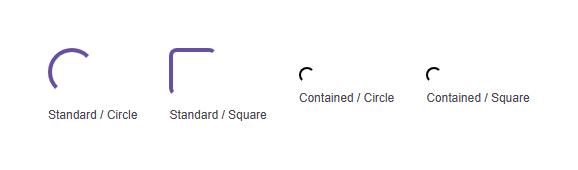

# @banegasn/m3-loading-indicator




> Material Design 3 Loading Indicator web component — framework-agnostic, built with Lit.

[](https://www.npmjs.com/package/@banegasn/m3-loading-indicator)
[](../../LICENSE)

An expressive **M3 Loading Indicator** web component following the [Material Design 3 progress indicator specifications](https://m3.material.io/components/progress-indicators/overview). Features unique shape morphing animations — the indicator transitions between circle and square shapes while loading. Works in Angular, React, Vue, Svelte, or plain HTML — no build step required.

## Features

- Standard and contained variants
- Circle and square shape morphing animation
- Accessible with ARIA `status` role
- Customizable via CSS custom properties
- Framework-agnostic custom element

## Installation

```bash
npm install @banegasn/m3-loading-indicator
# or
pnpm add @banegasn/m3-loading-indicator
# or
yarn add @banegasn/m3-loading-indicator
```

## CDN Usage (no build step)

```html
<!DOCTYPE html>
<html lang="en">
<head>
  <meta charset="UTF-8" />
  <title>M3 Loading Indicator Demo</title>
  <script type="module" src="https://cdn.jsdelivr.net/npm/@banegasn/m3-loading-indicator/+esm"></script>
  <style>
    body { font-family: Roboto, sans-serif; padding: 32px; background: #fef7ff; }
    .demo { display: flex; gap: 32px; align-items: center; flex-wrap: wrap; }
    label { font-size: 12px; color: #49454f; display: block; text-align: center; margin-top: 8px; }
  </style>
</head>
<body>
  <div class="demo">
    <div>
      <m3-loading-indicator variant="standard" shape="circle"></m3-loading-indicator>
      <label>Standard / Circle</label>
    </div>
    <div>
      <m3-loading-indicator variant="standard" shape="square"></m3-loading-indicator>
      <label>Standard / Square</label>
    </div>
    <div>
      <m3-loading-indicator variant="contained" shape="circle"></m3-loading-indicator>
      <label>Contained / Circle</label>
    </div>
    <div>
      <m3-loading-indicator variant="contained" shape="square"></m3-loading-indicator>
      <label>Contained / Square</label>
    </div>
  </div>
</body>
</html>
```

## npm Usage

```js
import '@banegasn/m3-loading-indicator';
```

```html
<m3-loading-indicator></m3-loading-indicator>
<m3-loading-indicator variant="contained" shape="square"></m3-loading-indicator>
```

## API

### Properties

| Property | Type | Default | Description |
|----------|------|---------|-------------|
| `variant` | `'standard' \| 'contained'` | `'standard'` | Indicator variant |
| `shape` | `'circle' \| 'square'` | `'circle'` | Morphing shape style |

### CSS Custom Properties

| Property | Default | Description |
|----------|---------|-------------|
| `--md-sys-color-primary` | `#6750a4` | Indicator color |
| `--md-sys-color-surface-container-high` | `#ece6f0` | Contained variant background |
| `--md-loading-indicator-size` | `48px` | Size of the indicator |

## Framework Usage

### Angular
```typescript
import '@banegasn/m3-loading-indicator';
```
```html
<m3-loading-indicator *ngIf="isLoading" variant="standard"></m3-loading-indicator>
```

### React
```jsx
import '@banegasn/m3-loading-indicator';
// {isLoading && <m3-loading-indicator variant="standard" />}
```

### Vue
```vue
<m3-loading-indicator v-if="isLoading" variant="standard" />
```

## Resources

- [Material Design 3 Progress Indicators](https://m3.material.io/components/progress-indicators/overview)
- [GitHub Repository](https://github.com/banegasn/components)

## License

MIT
