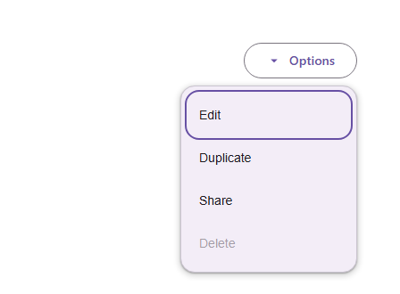

# @banegasn/m3-menu




> Material Design 3 Menu web component — framework-agnostic, built with Lit.

[](https://www.npmjs.com/package/@banegasn/m3-menu)
[](../../LICENSE)

An accessible **M3 Menu** web component following the [Material Design 3 menu specifications](https://m3.material.io/components/menus/overview). Includes `m3-menu` and `m3-menu-item` with smart positioning, keyboard navigation, and expressive animations. Works in Angular, React, Vue, Svelte, or plain HTML — no build step required.

## Features

- Smart auto-positioning (top, bottom, start, end)
- Keyboard navigation (arrow keys, Enter, Escape)
- Disabled menu items
- Accessible with ARIA `menu` and `menuitem` roles
- Pairs naturally with `@banegasn/m3-split-button`
- Framework-agnostic custom elements

## Installation

```bash
npm install @banegasn/m3-menu
# or
pnpm add @banegasn/m3-menu
# or
yarn add @banegasn/m3-menu
```

## CDN Usage (no build step)

```html
<!DOCTYPE html>
<html lang="en">
<head>
  <meta charset="UTF-8" />
  <title>M3 Menu Demo</title>
  <script type="module" src="https://cdn.jsdelivr.net/npm/@banegasn/m3-menu/+esm"></script>
  <script type="module" src="https://cdn.jsdelivr.net/npm/@banegasn/m3-button/+esm"></script>
  <style>
    body { font-family: Roboto, sans-serif; padding: 64px; background: #fef7ff; min-width: 400px }
    .anchor { position: relative; display: flex; justify-content: flex-end; }
  </style>
</head>
<body>
  <div class="anchor">
    <m3-button id="menu-trigger" variant="outlined">
      Options
      <svg slot="icon" viewBox="0 0 24 24" width="18" height="18">
        <path fill="currentColor" d="M7 10l5 5 5-5z"/>
      </svg>
    </m3-button>

    <m3-menu id="options-menu" open placement="bottom-end">
      <m3-menu-item value="edit">Edit</m3-menu-item>
      <m3-menu-item value="duplicate">Duplicate</m3-menu-item>
      <m3-menu-item value="share">Share</m3-menu-item>
      <m3-menu-item value="delete" disabled>Delete</m3-menu-item>
    </m3-menu>
  </div>

  <script>
    const menu = document.getElementById('options-menu');
    document.getElementById('menu-trigger').addEventListener('button-click', () => {
      menu.open = !menu.open;
    });
    menu.addEventListener('menu-item-click', (e) => {
      console.log('Selected:', e.detail.value);
      menu.open = false;
    });
  </script>
</body>
</html>
```

## npm Usage

```js
import '@banegasn/m3-menu';
```

```html
<m3-menu open placement="bottom-end">
  <m3-menu-item value="edit">Edit</m3-menu-item>
  <m3-menu-item value="duplicate">Duplicate</m3-menu-item>
  <m3-menu-item value="delete" disabled>Delete</m3-menu-item>
</m3-menu>
```

## API

### `m3-menu` Properties

| Property | Type | Default | Description |
|----------|------|---------|-------------|
| `open` | `boolean` | `false` | Whether the menu is open |
| `placement` | `'bottom-start' \| 'bottom-end' \| 'top-start' \| 'top-end'` | `'bottom-end'` | Menu placement relative to anchor |
| `offset` | `number` | `8` | Distance from anchor in pixels |

### `m3-menu` Events

| Event | Detail | Description |
|-------|--------|-------------|
| `menu-item-click` | `{ value: string }` | Fired when a menu item is selected |
| `menu-close` | `{}` | Fired when the menu closes |

### `m3-menu-item` Properties

| Property | Type | Default | Description |
|----------|------|---------|-------------|
| `value` | `string` | `''` | Item value returned in events |
| `disabled` | `boolean` | `false` | Disables the item |

### CSS Custom Properties

| Property | Default | Description |
|----------|---------|-------------|
| `--md-sys-color-surface-container` | `#f7f2fa` | Menu background |
| `--md-sys-color-on-surface` | `#1d1b20` | Menu item text color |
| `--md-sys-color-secondary-container` | `#e8def8` | Hover state background |
| `--md-menu-container-shape` | `4px` | Menu border radius |

## Framework Usage

### Angular
```typescript
import '@banegasn/m3-menu';
```
```html
<m3-menu [open]="menuOpen" (menu-item-click)="onMenuItemClick($event)" (menu-close)="menuOpen = false">
  <m3-menu-item value="edit">Edit</m3-menu-item>
  <m3-menu-item value="delete">Delete</m3-menu-item>
</m3-menu>
```

### React
```jsx
import '@banegasn/m3-menu';
// <m3-menu open={menuOpen} onmenu-item-click={handleClick} onmenu-close={() => setMenuOpen(false)}>...</m3-menu>
```

### Vue
```vue
<m3-menu :open="menuOpen" @menu-item-click="handleClick" @menu-close="menuOpen = false">
  <m3-menu-item value="edit">Edit</m3-menu-item>
</m3-menu>
```

## Related Packages

- [@banegasn/m3-split-button](https://www.npmjs.com/package/@banegasn/m3-split-button) — pairs naturally with m3-menu

## Resources

- [Material Design 3 Menus](https://m3.material.io/components/menus/overview)
- [GitHub Repository](https://github.com/banegasn/components)

## License

MIT
