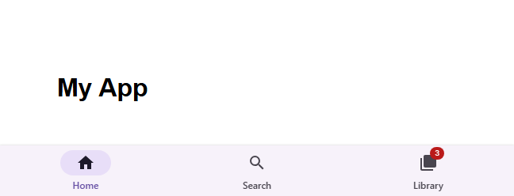

# @banegasn/m3-navigation-bar




> Material Design 3 Navigation Bar web component — framework-agnostic, built with Lit.

[](https://www.npmjs.com/package/@banegasn/m3-navigation-bar)
[](../../LICENSE)

A flexible **M3 Navigation Bar** web component following the [Material Design 3 navigation bar specifications](https://m3.material.io/components/navigation-bar/overview). Placed at the bottom of the screen for smaller devices, it supports both vertical (compact) and horizontal (medium) layouts with badge support. Works in Angular, React, Vue, Svelte, or plain HTML — no build step required.

## Features

- Vertical and horizontal layout modes
- Badge support (dot and count badges)
- Auto-layout switching for responsive designs
- Accessible with ARIA navigation role
- Framework-agnostic custom elements

## Installation

```bash
npm install @banegasn/m3-navigation-bar
# or
pnpm add @banegasn/m3-navigation-bar
# or
yarn add @banegasn/m3-navigation-bar
```

## CDN Usage (no build step)

```html
<!DOCTYPE html>
<html lang="en">
<head>
  <meta charset="UTF-8" />
  <title>M3 Navigation Bar Demo</title>
  <script type="module" src="https://cdn.jsdelivr.net/npm/@banegasn/m3-navigation-bar/+esm"></script>
  <style>
    body { font-family: Roboto, sans-serif; background: #fef7ff; min-height: 200px; min-width: 600px; margin: 0; display: flex; flex-direction: column; }
    main { flex: 1; padding: 24px; }
    m3-navigation-bar { position: fixed; bottom: 0; left: 0; right: 0; }
  </style>
</head>
<body>
  <main><h1>My App</h1></main>

  <m3-navigation-bar>
    <m3-navigation-bar-item label="Home" active>
      <svg slot="icon" viewBox="0 0 24 24" width="24" height="24">
        <path fill="currentColor" d="M10 20v-6h4v6h5v-8h3L12 3 2 12h3v8z"/>
      </svg>
    </m3-navigation-bar-item>
    <m3-navigation-bar-item label="Search">
      <svg slot="icon" viewBox="0 0 24 24" width="24" height="24">
        <path fill="currentColor" d="M15.5 14h-.79l-.28-.27A6.471 6.471 0 0 0 16 9.5 6.5 6.5 0 1 0 9.5 16c1.61 0 3.09-.59 4.23-1.57l.27.28v.79l5 4.99L20.49 19l-4.99-5zm-6 0C7.01 14 5 11.99 5 9.5S7.01 5 9.5 5 14 7.01 14 9.5 11.99 14 9.5 14z"/>
      </svg>
    </m3-navigation-bar-item>
    <m3-navigation-bar-item label="Library" badge="3">
      <svg slot="icon" viewBox="0 0 24 24" width="24" height="24">
        <path fill="currentColor" d="M4 6H2v14c0 1.1.9 2 2 2h14v-2H4V6zm16-4H8c-1.1 0-2 .9-2 2v12c0 1.1.9 2 2 2h12c1.1 0 2-.9 2-2V4c0-1.1-.9-2-2-2z"/>
      </svg>
    </m3-navigation-bar-item>
  </m3-navigation-bar>

  <script>
    document.querySelector('m3-navigation-bar').addEventListener('item-click', (e) => {
      const items = document.querySelectorAll('m3-navigation-bar-item');
      items.forEach(item => item.active = false);
      e.target.active = true;
    });
  </script>
</body>
</html>
```

## Components

This package includes two components:

- `m3-navigation-bar` - The main container for navigation items
- `m3-navigation-bar-item` - Individual navigation items with icons and labels

## Usage

### Basic Example

```html
<m3-navigation-bar>
  <m3-navigation-bar-item label="Home" active>
    <svg slot="icon" viewBox="0 0 24 24" width="24" height="24">
      <path fill="currentColor" d="M10 20v-6h4v6h5v-8h3L12 3 2 12h3v8z"/>
    </svg>
  </m3-navigation-bar-item>
  
  <m3-navigation-bar-item label="Music">
    <svg slot="icon" viewBox="0 0 24 24" width="24" height="24">
      <path fill="currentColor" d="M12 3v10.55c-.59-.34-1.27-.55-2-.55-2.21 0-4 1.79-4 4s1.79 4 4 4 4-1.79 4-4V7h4V3h-6z"/>
    </svg>
  </m3-navigation-bar-item>
  
  <m3-navigation-bar-item label="Podcasts">
    <svg slot="icon" viewBox="0 0 24 24" width="24" height="24">
      <path fill="currentColor" d="M12 14c1.66 0 2.99-1.34 2.99-3L15 5c0-1.66-1.34-3-3-3S9 3.34 9 5v6c0 1.66 1.34 3 3 3zm5.3-3c0 3-2.54 5.1-5.3 5.1S6.7 14 6.7 11H5c0 3.41 2.72 6.23 6 6.72V21h2v-3.28c3.28-.48 6-3.3 6-6.72h-1.7z"/>
    </svg>
  </m3-navigation-bar-item>
</m3-navigation-bar>
```

### With Badges

Navigation items can display badges to show notifications or counts:

```html
<m3-navigation-bar>
  <m3-navigation-bar-item label="Home" active badge="3">
    <svg slot="icon" viewBox="0 0 24 24" width="24" height="24">
      <path fill="currentColor" d="M10 20v-6h4v6h5v-8h3L12 3 2 12h3v8z"/>
    </svg>
  </m3-navigation-bar-item>
  
  <m3-navigation-bar-item label="Notifications" badge="">
    <svg slot="icon" viewBox="0 0 24 24" width="24" height="24">
      <path fill="currentColor" d="M12 22c1.1 0 2-.9 2-2h-4c0 1.1.9 2 2 2zm6-6v-5c0-3.07-1.64-5.64-4.5-6.32V4c0-.83-.67-1.5-1.5-1.5s-1.5.67-1.5 1.5v.68C7.63 5.36 6 7.92 6 11v5l-2 2v1h16v-1l-2-2z"/>
    </svg>
  </m3-navigation-bar-item>
</m3-navigation-bar>
```

### Horizontal Layout (Medium Windows)

The navigation bar automatically switches to horizontal item layout in medium windows. Items will have fixed widths and extra space is added to the ends of the navigation bar.

```html
<m3-navigation-bar>
  <!-- Items will display horizontally in medium windows -->
  <m3-navigation-bar-item label="Home" active>...</m3-navigation-bar-item>
  <m3-navigation-bar-item label="Search">...</m3-navigation-bar-item>
  <m3-navigation-bar-item label="Library">...</m3-navigation-bar-item>
</m3-navigation-bar>
```

## API Reference

### m3-navigation-bar

The main container component for the navigation bar.

#### Properties

| Property | Type | Default | Description |
|----------|------|---------|-------------|
| `layout` | `'vertical' \| 'horizontal'` | `'vertical'` | Layout mode for navigation items |

#### Events

| Event | Detail | Description |
|-------|--------|-------------|
| `item-click` | `{ label: string }` | Fired when a navigation item is clicked (bubbles from items) |

#### Slots

| Slot | Description |
|------|-------------|
| (default) | Navigation bar items |

#### CSS Custom Properties

| Property | Default | Description |
|----------|---------|-------------|
| `--md-sys-color-surface-container` | `#f7f2fa` | Background color of the navigation bar |
| `--md-sys-elevation-level2` | `0px 1px 2px 0px rgba(0, 0, 0, 0.3), 0px 1px 3px 1px rgba(0, 0, 0, 0.15)` | Elevation shadow |

---

### m3-navigation-bar-item

Individual navigation item with icon and label.

#### Properties

| Property | Type | Default | Description |
|----------|------|---------|-------------|
| `active` | `boolean` | `false` | Whether the item is currently active/selected |
| `label` | `string` | `''` | Text label for the navigation item |
| `badge` | `string` | `''` | Badge text to display (empty string shows a dot badge) |
| `largeBadge` | `string` | `''` | Large badge text (displays larger badge) |
| `layout` | `'vertical' \| 'horizontal'` | `'vertical'` | Layout mode (automatically set by parent bar) |

#### Events

| Event | Detail | Description |
|-------|--------|-------------|
| `item-click` | `{ label: string }` | Fired when the item is clicked |

#### Slots

| Slot | Description |
|------|-------------|
| `icon` | SVG or icon element (24x24px recommended) |

#### CSS Custom Properties

| Property | Default | Description |
|----------|---------|-------------|
| `--md-sys-color-secondary-container` | `#e8def8` | Active item indicator background |
| `--md-sys-color-on-secondary-container` | `#1d192b` | Active item icon color |
| `--md-sys-color-secondary` | `#6750a4` | Active item label text color |
| `--md-sys-color-on-surface-variant` | `#49454f` | Inactive item text/icon color |

## Design Tokens

The navigation bar follows Material Design 3 specifications and uses the following design tokens:

- **Container**: `md.sys.color.surface-container`, `md.sys.elevation.level2`
- **Active Indicator**: `md.sys.color.secondary-container`
- **Active Label**: `md.sys.color.secondary`
- **Active Icon**: `md.sys.color.on-secondary-container`
- **Inactive Label/Icon**: `md.sys.color.on-surface-variant`
- **State Layers**: 8% hover, 10% focus, 10% pressed

## Browser Support

This component uses modern web standards and requires browsers that support:
- Custom Elements v1
- Shadow DOM v1
- ES6+ features

## Resources

- [Material Design 3 Navigation Bar](https://m3.material.io/components/navigation-bar/overview)
- [GitHub Repository](https://github.com/banegasn/components)

## License

MIT
