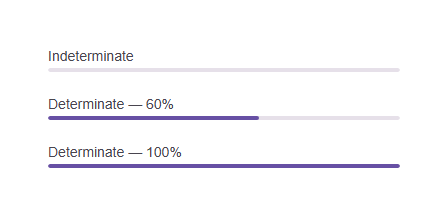

# @banegasn/m3-progress




> Material Design 3 Progress Indicator web component — framework-agnostic, built with Lit.

[](https://www.npmjs.com/package/@banegasn/m3-progress)
[](../../LICENSE)

A lightweight **M3 Linear Progress Indicator** web component following the [Material Design 3 progress indicator specifications](https://m3.material.io/components/progress-indicators/overview). Supports determinate and indeterminate states. Works in Angular, React, Vue, Svelte, or plain HTML — no build step required.

## Features

- Determinate and indeterminate modes
- Smooth animation following M3 motion specs
- Accessible with ARIA `progressbar` role
- Customizable via CSS custom properties
- Framework-agnostic custom element

## Installation

```bash
npm install @banegasn/m3-progress
# or
pnpm add @banegasn/m3-progress
# or
yarn add @banegasn/m3-progress
```

## CDN Usage (no build step)

```html
<!DOCTYPE html>
<html lang="en">
<head>
  <meta charset="UTF-8" />
  <title>M3 Progress Demo</title>
  <script type="module" src="https://cdn.jsdelivr.net/npm/@banegasn/m3-progress/+esm"></script>
  <style>
    body { font-family: Roboto, sans-serif; padding: 32px; background: #fef7ff; min-width: 400px}
    .demo { display: flex; flex-direction: column; gap: 24px; max-width: 400px; }
    label { font-size: 14px; color: #49454f; margin-bottom: 4px; display: block; }
  </style>
</head>
<body>
  <div class="demo">
    <div>
      <label>Indeterminate</label>
      <m3-progress></m3-progress>
    </div>

    <div>
      <label>Determinate — 60%</label>
      <m3-progress value="0.6"></m3-progress>
    </div>

    <div>
      <label>Determinate — 100%</label>
      <m3-progress value="1"></m3-progress>
    </div>
  </div>
</body>
</html>
```

## npm Usage

```js
import '@banegasn/m3-progress';
```

```html
<!-- Indeterminate -->
<m3-progress></m3-progress>

<!-- Determinate (value between 0 and 1) -->
<m3-progress value="0.75"></m3-progress>
```

## API

### Properties

| Property | Type | Default | Description |
|----------|------|---------|-------------|
| `value` | `number \| null` | `null` | Progress value between `0` and `1`. `null` = indeterminate. |
| `buffer` | `number` | `1` | Buffer value between `0` and `1` (for buffered progress) |

### CSS Custom Properties

| Property | Default | Description |
|----------|---------|-------------|
| `--md-sys-color-primary` | `#6750a4` | Active track color |
| `--md-sys-color-surface-container-highest` | `#e6e0e9` | Track background color |
| `--md-progress-track-height` | `4px` | Height of the progress bar |

## Framework Usage

### Angular
```typescript
import '@banegasn/m3-progress';
```
```html
<m3-progress [value]="uploadProgress"></m3-progress>
```

### React
```jsx
import '@banegasn/m3-progress';
// <m3-progress value={uploadProgress} />
```

### Vue
```vue
<m3-progress :value="uploadProgress" />
```

## Resources

- [Material Design 3 Progress Indicators](https://m3.material.io/components/progress-indicators/overview)
- [GitHub Repository](https://github.com/banegasn/components)

## License

MIT
