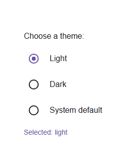

# @banegasn/m3-radio-button




> Material Design 3 Radio Button web component — framework-agnostic, built with Lit.

[](https://www.npmjs.com/package/@banegasn/m3-radio-button)
[](../../LICENSE)

An accessible **M3 Radio Button** web component following the [Material Design 3 radio button specifications](https://m3.material.io/components/radio-button/overview). Radio buttons allow users to select a single option from a group. Works in Angular, React, Vue, Svelte, or plain HTML — no build step required.

## Features

- Single-selection from a group via `name` attribute
- Checked and disabled states
- Form integration (name, value, form attributes)
- Accessible with ARIA `radio` role
- Keyboard navigation (Space and Enter keys)
- Framework-agnostic custom element

## Installation

```bash
npm install @banegasn/m3-radio-button
# or
pnpm add @banegasn/m3-radio-button
# or
yarn add @banegasn/m3-radio-button
```

## CDN Usage (no build step)

```html
<!DOCTYPE html>
<html lang="en">
<head>
  <meta charset="UTF-8" />
  <title>M3 Radio Button Demo</title>
  <script type="module" src="https://cdn.jsdelivr.net/npm/@banegasn/m3-radio-button/+esm"></script>
  <style>
    body { font-family: Roboto, sans-serif; padding: 32px; background: #fef7ff; }
    .row { display: flex; align-items: center; gap: 12px; margin-bottom: 12px; }
    label { font-size: 16px; color: #1d1b20; }
    #result { margin-top: 16px; font-size: 14px; color: #6750a4; }
  </style>
</head>
<body>
  <p style="font-weight:500;color:#1d1b20;">Choose a theme:</p>
  <div class="row">
    <m3-radio-button name="theme" value="light" checked></m3-radio-button>
    <label>Light</label>
  </div>
  <div class="row">
    <m3-radio-button name="theme" value="dark"></m3-radio-button>
    <label>Dark</label>
  </div>
  <div class="row">
    <m3-radio-button name="theme" value="auto"></m3-radio-button>
    <label>System default</label>
  </div>
  <p id="result">Selected: light</p>

  <script>
    document.querySelectorAll('m3-radio-button[name="theme"]').forEach(radio => {
      radio.addEventListener('radio-change', (e) => {
        document.getElementById('result').textContent = 'Selected: ' + e.detail.value;
      });
    });
  </script>
</body>
</html>
```

## npm Usage

```js
import '@banegasn/m3-radio-button';
```

```html
<m3-radio-button name="option" value="1"></m3-radio-button>
<m3-radio-button name="option" value="2" checked></m3-radio-button>
<m3-radio-button name="option" value="3" disabled></m3-radio-button>
```

### Radio Group

Radio buttons with the same `name` attribute form a group where only one can be selected:

```html
<m3-radio-button name="theme" value="light" checked>Light</m3-radio-button>
<m3-radio-button name="theme" value="dark">Dark</m3-radio-button>
<m3-radio-button name="theme" value="auto">Auto</m3-radio-button>
```

## With JavaScript

```javascript
import '@banegasn/m3-radio-button';

const radioButtons = document.querySelectorAll('m3-radio-button[name="option"]');
radioButtons.forEach(radio => {
  radio.addEventListener('radio-change', (e) => {
    console.log('Selected:', e.detail.value);
  });
});
```

### With React

```jsx
import '@banegasn/m3-radio-button';

function App() {
  const [selected, setSelected] = useState('option1');

  return (
    <>
      <m3-radio-button
        name="group"
        value="option1"
        checked={selected === 'option1'}
        onRadioChange={(e) => setSelected(e.detail.value)}
      />
      <m3-radio-button
        name="group"
        value="option2"
        checked={selected === 'option2'}
        onRadioChange={(e) => setSelected(e.detail.value)}
      />
    </>
  );
}
```

### With Angular

```typescript
import '@banegasn/m3-radio-button';

@Component({
  template: `
    <m3-radio-button
      name="group"
      value="option1"
      [checked]="selected === 'option1'"
      (radio-change)="onRadioChange($event)"
    ></m3-radio-button>
  `
})
export class MyComponent {
  selected = 'option1';

  onRadioChange(event: CustomEvent) {
    this.selected = event.detail.value;
  }
}
```

### With Vue

```vue
<template>
  <m3-radio-button
    name="group"
    value="option1"
    :checked="selected === 'option1'"
    @radio-change="onRadioChange"
  />
</template>

<script setup>
import '@banegasn/m3-radio-button';
import { ref } from 'vue';

const selected = ref('option1');

const onRadioChange = (event) => {
  selected.value = event.detail.value;
};
</script>
```

## Properties

| Property | Type | Default | Description |
|----------|------|---------|-------------|
| `checked` | `boolean` | `false` | Whether the radio button is checked |
| `disabled` | `boolean` | `false` | Disables the radio button |
| `name` | `string` | `null` | Name attribute for radio group (required for grouping) |
| `value` | `string` | `null` | Value attribute for form submission |
| `form` | `string` | `null` | Form attribute to associate radio with a form |
| `aria-label` | `string` | `null` | ARIA label for accessibility |
| `aria-labelledby` | `string` | `null` | ARIA labelled by for accessibility |

## Events

| Event | Detail | Description |
|-------|--------|-------------|
| `radio-change` | `{ checked: boolean, name: string \| null, value: string \| null }` | Fired when the radio button state changes |

## Methods

| Method | Description |
|--------|-------------|
| `focus()` | Focuses the radio button |
| `blur()` | Removes focus from the radio button |

## CSS Custom Properties

You can customize the radio button appearance using CSS custom properties:

```css
m3-radio-button {
  --md-radio-size: 20px;
  --md-radio-outer-size: 20px;
  --md-radio-inner-size: 10px;
  --md-radio-ripple-size: 40px;
  --md-sys-color-primary: #6750a4;
  --md-sys-color-on-surface: #1d1b20;
}
```

## Radio Groups

Radio buttons with the same `name` attribute automatically form a group. When one radio button in a group is selected, all others in the same group are automatically deselected.

## Accessibility

The radio button component follows Material Design 3 accessibility guidelines:

- Uses proper ARIA attributes (`role="radio"`, `aria-checked`, `aria-disabled`)
- Supports keyboard navigation (Space and Enter keys)
- Provides focus indicators
- Supports screen readers with `aria-label` and `aria-labelledby`
- Properly manages radio groups

## Browser Support

- Chrome/Edge (latest)
- Firefox (latest)
- Safari (latest)
- All modern browsers that support Web Components

## Resources

- [Material Design 3 Radio Button](https://m3.material.io/components/radio-button/overview)
- [GitHub Repository](https://github.com/banegasn/components)

## License

MIT
