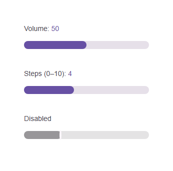

# @banegasn/m3-slider




> Material Design 3 Slider web component — framework-agnostic, built with Lit.

[](https://www.npmjs.com/package/@banegasn/m3-slider)
[](../../LICENSE)

An accessible **M3 Slider** web component following the [Material Design 3 slider specifications](https://m3.material.io/components/sliders/overview). Supports continuous and discrete (stepped) modes with expressive styling. Works in Angular, React, Vue, Svelte, or plain HTML — no build step required.

## Features

- Continuous and discrete (stepped) modes
- Range slider support (two handles)
- Value label on drag
- Keyboard accessible (arrow keys)
- Accessible with ARIA `slider` role
- Framework-agnostic custom element

## Installation

```bash
npm install @banegasn/m3-slider
# or
pnpm add @banegasn/m3-slider
# or
yarn add @banegasn/m3-slider
```

## CDN Usage (no build step)

```html
<!DOCTYPE html>
<html lang="en">
<head>
  <meta charset="UTF-8" />
  <title>M3 Slider Demo</title>
  <script type="module" src="https://cdn.jsdelivr.net/npm/@banegasn/m3-slider/+esm"></script>
  <style>
    body { font-family: Roboto, sans-serif; padding: 32px; background: #fef7ff; max-width: 400px; }
    .demo { display: flex; flex-direction: column; gap: 24px; }
    label { font-size: 14px; color: #49454f; }
    output { font-size: 14px; color: #6750a4; font-weight: 500; }
  </style>
</head>
<body>
  <div class="demo">
    <div>
      <label>Volume: <output id="vol-out">50</output></label>
      <m3-slider id="volume" min="0" max="100" value="50"></m3-slider>
    </div>

    <div>
      <label>Steps (0–10): <output id="step-out">4</output></label>
      <m3-slider id="steps" min="0" max="10" value="4" step="1"></m3-slider>
    </div>

    <div>
      <label>Disabled</label>
      <m3-slider min="0" max="100" value="30" disabled></m3-slider>
    </div>
  </div>

  <script>
    document.getElementById('volume').addEventListener('slider-change', (e) => {
      document.getElementById('vol-out').textContent = e.detail.value;
    });
    document.getElementById('steps').addEventListener('slider-change', (e) => {
      document.getElementById('step-out').textContent = e.detail.value;
    });
  </script>
</body>
</html>
```

## npm Usage

```js
import '@banegasn/m3-slider';
```

```html
<m3-slider min="0" max="100" value="50"></m3-slider>
<m3-slider min="0" max="10" value="4" step="1"></m3-slider>
<m3-slider disabled value="30"></m3-slider>
```

## API

### Properties

| Property | Type | Default | Description |
|----------|------|---------|-------------|
| `min` | `number` | `0` | Minimum value |
| `max` | `number` | `100` | Maximum value |
| `value` | `number` | `0` | Current value |
| `step` | `number` | `1` | Step increment (use `0` for continuous) |
| `disabled` | `boolean` | `false` | Disables the slider |
| `name` | `string \| null` | `null` | Name for form submission |

### Events

| Event | Detail | Description |
|-------|--------|-------------|
| `slider-change` | `{ value: number, name: string \| null }` | Fired when the value changes |
| `slider-input` | `{ value: number, name: string \| null }` | Fired continuously while dragging |

### CSS Custom Properties

| Property | Default | Description |
|----------|---------|-------------|
| `--md-sys-color-primary` | `#6750a4` | Active track and handle color |
| `--md-sys-color-surface-container-highest` | `#e6e0e9` | Inactive track color |
| `--md-slider-handle-size` | `20px` | Size of the thumb handle |

## Framework Usage

### Angular
```typescript
import '@banegasn/m3-slider';
```
```html
<m3-slider [value]="volume" min="0" max="100" (slider-change)="onVolumeChange($event)"></m3-slider>
```

### React
```jsx
import '@banegasn/m3-slider';
// <m3-slider value={volume} min={0} max={100} onslider-change={handleChange} />
```

### Vue
```vue
<m3-slider :value="volume" min="0" max="100" @slider-change="handleChange" />
```

## Resources

- [Material Design 3 Sliders](https://m3.material.io/components/sliders/overview)
- [GitHub Repository](https://github.com/banegasn/components)

## License

MIT
