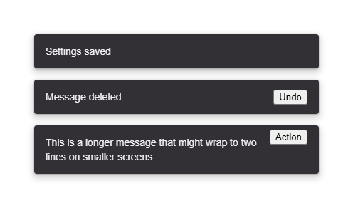

# @banegasn/m3-snackbar



Material Design 3 Snackbar web component with expressive entrance/exit animations.

## Features

- **Auto-dismiss**: Configurable duration with `duration` property (default: 4000ms)
- **Action slot**: Optional action button with click handling
- **Entrance/exit animations**: Smooth slide-up and scale transitions
- **Two-line support**: For longer messages
- **Programmatic API**: `show()` and `dismiss()` methods
- **Accessible**: ARIA live regions and proper roles

## Installation

```bash
npm install @banegasn/m3-snackbar
```

## Usage

```html
<script type="module">
  import '@banegasn/m3-snackbar';
</script>

<!-- Basic snackbar -->
<m3-snackbar open>Settings saved</m3-snackbar>

<!-- With action -->
<m3-snackbar open>
  Message deleted
  <button slot="action">Undo</button>
</m3-snackbar>

<!-- Two-line -->
<m3-snackbar open lines="2">
  This is a longer message that might wrap to two lines on smaller screens.
  <button slot="action">Action</button>
</m3-snackbar>

<!-- Programmatic control -->
<m3-snackbar id="snack" duration="3000">Hello!</m3-snackbar>
<script>
  document.getElementById('snack').show();
</script>
```

## CDN Usage (no build step)

```html
<!DOCTYPE html>
<html lang="en">
<head>
  <meta charset="UTF-8" />
  <title>M3 Snackbar Demo</title>
  <script type="module" src="https://cdn.jsdelivr.net/npm/@banegasn/m3-snackbar/+esm"></script>
  <style>
    body { font-family: Roboto, sans-serif; padding: 32px; background: #fef7ff; }
    .col { display: flex; flex-direction: column; gap: 16px; max-width: 400px; }
  </style>
</head>
<body>
  <div class="col">
    <m3-snackbar open>Settings saved</m3-snackbar>
    <m3-snackbar open>
      Message deleted
      <button slot="action">Undo</button>
    </m3-snackbar>
    <m3-snackbar open lines="2">
      This is a longer message that might wrap to two lines on smaller screens.
      <button slot="action">Action</button>
    </m3-snackbar>
  </div>
</body>
</html>
```

## Events

- `snackbar-dismiss` - Fired when the snackbar is dismissed
- `snackbar-action` - Fired when the action button is clicked

## License

MIT
