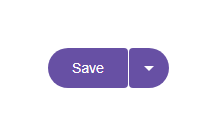

# @banegasn/m3-split-button




> Material Design 3 Split Button web component — framework-agnostic, built with Lit.

[](https://www.npmjs.com/package/@banegasn/m3-split-button)
[](../../LICENSE)

An expressive **M3 Split Button** web component — a button with a primary action and a secondary dropdown trigger. Features shape morphing and rotation animations following Material Design 3 expressive motion. Works in Angular, React, Vue, Svelte, or plain HTML — no build step required.

## Features

- Primary action + dropdown trigger in one component
- Shape morphing animation on menu open
- Filled, outlined, tonal, and elevated variants
- Pairs with `@banegasn/m3-menu` for the dropdown
- Keyboard accessible
- Framework-agnostic custom element

## Installation

```bash
npm install @banegasn/m3-split-button
# or
pnpm add @banegasn/m3-split-button
# or
yarn add @banegasn/m3-split-button
```

## CDN Usage (no build step)

```html
<!DOCTYPE html>
<html lang="en">
<head>
  <meta charset="UTF-8" />
  <title>M3 Split Button Demo</title>
  <script type="module" src="https://cdn.jsdelivr.net/npm/@banegasn/m3-split-button/+esm"></script>
  <script type="module" src="https://cdn.jsdelivr.net/npm/@banegasn/m3-menu/+esm"></script>
  <style>
    body { font-family: Roboto, sans-serif; padding: 32px; background: #fef7ff; }
    .container { position: relative; display: inline-flex; }
  </style>
</head>
<body>
  <div class="container">
    <m3-split-button id="split-btn" variant="filled" menu-id="action-menu">
      Save
    </m3-split-button>

    <m3-menu id="action-menu" placement="bottom-end">
      <m3-menu-item value="save-draft">Save as draft</m3-menu-item>
      <m3-menu-item value="save-copy">Save a copy</m3-menu-item>
      <m3-menu-item value="export">Export</m3-menu-item>
    </m3-menu>
  </div>

  <script>
    const btn = document.getElementById('split-btn');
    const menu = document.getElementById('action-menu');

    btn.addEventListener('split-button-click', () => {
      console.log('Primary action: Save');
    });

    btn.addEventListener('split-button-dropdown-click', () => {
      menu.open = !menu.open;
      btn.menuOpen = menu.open;
    });

    menu.addEventListener('menu-item-click', (e) => {
      console.log('Menu action:', e.detail.value);
      menu.open = false;
      btn.menuOpen = false;
    });
  </script>
</body>
</html>
```

## npm Usage

```js
import '@banegasn/m3-split-button';
import '@banegasn/m3-menu';
```

```html
<m3-split-button variant="filled" menu-id="my-menu">
  Save
</m3-split-button>

<m3-menu id="my-menu" placement="bottom-end">
  <m3-menu-item value="draft">Save as draft</m3-menu-item>
  <m3-menu-item value="copy">Save a copy</m3-menu-item>
</m3-menu>
```

## API

### Properties

| Property | Type | Default | Description |
|----------|------|---------|-------------|
| `variant` | `'filled' \| 'outlined' \| 'tonal' \| 'elevated'` | `'filled'` | Button style variant |
| `menuOpen` | `boolean` | `false` | Reflects whether the associated menu is open (affects shape morphing) |
| `menuId` | `string \| null` | `null` | ID of the controlled `m3-menu` element |
| `disabled` | `boolean` | `false` | Disables both button sections |

### Events

| Event | Detail | Description |
|-------|--------|-------------|
| `split-button-click` | `{ variant: string }` | Fired when the primary action is clicked |
| `split-button-dropdown-click` | `{ variant: string }` | Fired when the dropdown arrow is clicked |

### Slots

| Slot | Description |
|------|-------------|
| (default) | Primary button label |

### CSS Custom Properties

| Property | Default | Description |
|----------|---------|-------------|
| `--md-sys-color-primary` | `#6750a4` | Filled variant background |
| `--md-sys-color-on-primary` | `#ffffff` | Filled variant text color |
| `--md-sys-color-outline` | `#79747e` | Outlined variant border |

## Framework Usage

### Angular
```typescript
import '@banegasn/m3-split-button';
import '@banegasn/m3-menu';
```
```html
<m3-split-button variant="filled" [menuOpen]="menuOpen" (split-button-click)="save()" (split-button-dropdown-click)="menuOpen = !menuOpen">
  Save
</m3-split-button>
```

### React
```jsx
import '@banegasn/m3-split-button';
// <m3-split-button variant="filled" menuOpen={menuOpen} onsplit-button-click={save}>Save</m3-split-button>
```

### Vue
```vue
<m3-split-button variant="filled" :menuOpen="menuOpen" @split-button-click="save" @split-button-dropdown-click="menuOpen = !menuOpen">
  Save
</m3-split-button>
```

## Related Packages

- [@banegasn/m3-menu](https://www.npmjs.com/package/@banegasn/m3-menu) — pairs naturally with split button
- [@banegasn/m3-button](https://www.npmjs.com/package/@banegasn/m3-button) — standard M3 button

## Resources

- [Material Design 3 Buttons](https://m3.material.io/components/buttons/overview)
- [GitHub Repository](https://github.com/banegasn/components)

## License

MIT
