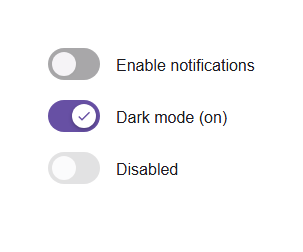

# @banegasn/m3-switch




> Material Design 3 Switch web component — framework-agnostic, built with Lit.

[](https://www.npmjs.com/package/@banegasn/m3-switch)
[](../../LICENSE)

An accessible **M3 Switch** web component following the [Material Design 3 switch specifications](https://m3.material.io/components/switch/overview). A switch allows users to toggle between on and off states. Works in Angular, React, Vue, Svelte, or plain HTML — no build step required.

## Features

- On/off toggle with expressive M3 animation
- Disabled state support
- Form integration (name, value, form attributes)
- Accessible with ARIA `switch` role
- Keyboard navigation (Space and Enter keys)
- Framework-agnostic custom element

## Installation

```bash
npm install @banegasn/m3-switch
# or
pnpm add @banegasn/m3-switch
# or
yarn add @banegasn/m3-switch
```

## CDN Usage (no build step)

```html
<!DOCTYPE html>
<html lang="en">
<head>
  <meta charset="UTF-8" />
  <title>M3 Switch Demo</title>
  <script type="module" src="https://cdn.jsdelivr.net/npm/@banegasn/m3-switch/+esm"></script>
  <style>
    body { font-family: Roboto, sans-serif; padding: 32px; background: #fef7ff; }
    .row { display: flex; align-items: center; gap: 16px; margin-bottom: 16px; }
    label { font-size: 16px; color: #1d1b20; }
  </style>
</head>
<body>
  <div class="row">
    <m3-switch id="notifications"></m3-switch>
    <label>Enable notifications</label>
  </div>
  <div class="row">
    <m3-switch checked></m3-switch>
    <label>Dark mode (on)</label>
  </div>
  <div class="row">
    <m3-switch disabled></m3-switch>
    <label>Disabled</label>
  </div>

  <script>
    document.getElementById('notifications').addEventListener('switch-change', (e) => {
      console.log('Notifications:', e.detail.checked ? 'enabled' : 'disabled');
    });
  </script>
</body>
</html>
```

## npm Usage

```js
import '@banegasn/m3-switch';
```

```html
<m3-switch></m3-switch>
<m3-switch checked></m3-switch>
<m3-switch disabled></m3-switch>
```

## With JavaScript

```javascript
import '@banegasn/m3-switch';

const switchElement = document.querySelector('m3-switch');
switchElement.addEventListener('switch-change', (e) => {
  console.log('Switch is now:', e.detail.checked);
});
```

### With React

```jsx
import '@banegasn/m3-switch';

function App() {
  const [checked, setChecked] = useState(false);

  return (
    <m3-switch
      checked={checked}
      onSwitchChange={(e) => setChecked(e.detail.checked)}
    />
  );
}
```

### With Angular

```typescript
import '@banegasn/m3-switch';

@Component({
  template: `
    <m3-switch
      [checked]="isChecked"
      (switch-change)="onSwitchChange($event)"
    ></m3-switch>
  `
})
export class MyComponent {
  isChecked = false;

  onSwitchChange(event: CustomEvent) {
    this.isChecked = event.detail.checked;
  }
}
```

### With Vue

```vue
<template>
  <m3-switch
    :checked="isChecked"
    @switch-change="onSwitchChange"
  />
</template>

<script setup>
import '@banegasn/m3-switch';
import { ref } from 'vue';

const isChecked = ref(false);

const onSwitchChange = (event) => {
  isChecked.value = event.detail.checked;
};
</script>
```

## Properties

| Property | Type | Default | Description |
|----------|------|---------|-------------|
| `checked` | `boolean` | `false` | Whether the switch is checked (on) |
| `disabled` | `boolean` | `false` | Disables the switch |
| `name` | `string` | `null` | Name attribute for form submission |
| `value` | `string` | `null` | Value attribute for form submission |
| `form` | `string` | `null` | Form attribute to associate switch with a form |
| `aria-label` | `string` | `null` | ARIA label for accessibility |
| `aria-labelledby` | `string` | `null` | ARIA labelled by for accessibility |

## Events

| Event | Detail | Description |
|-------|--------|-------------|
| `switch-change` | `{ checked: boolean, name: string \| null, value: string \| null }` | Fired when the switch state changes |

## Methods

| Method | Description |
|--------|-------------|
| `focus()` | Focuses the switch |
| `blur()` | Removes focus from the switch |

## CSS Custom Properties

You can customize the switch appearance using CSS custom properties:

```css
m3-switch {
  --md-switch-track-width: 52px;
  --md-switch-track-height: 32px;
  --md-switch-thumb-size: 24px;
  --md-switch-track-shape: 16px;
  --md-switch-thumb-shape: 12px;
  --md-sys-color-primary: #6750a4;
  --md-sys-color-on-primary: #ffffff;
  --md-sys-color-on-surface: #1d1b20;
  --md-sys-color-surface-container-highest: #e6e0e9;
}
```

## Accessibility

The switch component follows Material Design 3 accessibility guidelines:

- Uses proper ARIA attributes (`role="switch"`, `aria-checked`, `aria-disabled`)
- Supports keyboard navigation (Space and Enter keys)
- Provides focus indicators
- Supports screen readers with `aria-label` and `aria-labelledby`

## Browser Support

- Chrome/Edge (latest)
- Firefox (latest)
- Safari (latest)
- All modern browsers that support Web Components

## Resources

- [Material Design 3 Switch](https://m3.material.io/components/switch/overview)
- [GitHub Repository](https://github.com/banegasn/components)

## License

MIT
