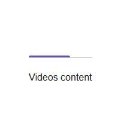

# @banegasn/m3-tabs




> Material Design 3 Tabs web component — framework-agnostic, built with Lit.

[](https://www.npmjs.com/package/@banegasn/m3-tabs)
[](../../LICENSE)

Accessible **M3 Tabs** web components following the [Material Design 3 tabs specifications](https://m3.material.io/components/tabs/overview). Includes primary and secondary tab styles with animated indicator. Works in Angular, React, Vue, Svelte, or plain HTML — no build step required.

## Features

- Primary and secondary tab variants
- Animated active indicator
- Optional icon support per tab
- Keyboard accessible (arrow key navigation)
- Framework-agnostic custom elements

## Installation

```bash
npm install @banegasn/m3-tabs
# or
pnpm add @banegasn/m3-tabs
# or
yarn add @banegasn/m3-tabs
```

## CDN Usage (no build step)

```html
<!DOCTYPE html>
<html lang="en">
<head>
  <meta charset="UTF-8" />
  <title>M3 Tabs Demo</title>
  <script type="module" src="https://cdn.jsdelivr.net/npm/@banegasn/m3-tabs/+esm"></script>
  <style>
    body { font-family: Roboto, sans-serif; padding: 32px; background: #fef7ff; }
    .tab-content { padding: 24px 0; color: #1d1b20; }
  </style>
</head>
<body>
  <m3-tabs>
    <m3-tab label="Videos" active></m3-tab>
    <m3-tab label="Music"></m3-tab>
    <m3-tab label="Podcasts"></m3-tab>
  </m3-tabs>

  <div class="tab-content" id="content">Videos content</div>

  <script>
    const contents = ['Videos content', 'Music content', 'Podcasts content'];
    document.querySelector('m3-tabs').addEventListener('tab-change', (e) => {
      document.getElementById('content').textContent = contents[e.detail.index];
    });
  </script>
</body>
</html>
```

## npm Usage

```js
import '@banegasn/m3-tabs';
```

```html
<m3-tabs>
  <m3-tab label="Tab One" active></m3-tab>
  <m3-tab label="Tab Two"></m3-tab>
  <m3-tab label="Tab Three"></m3-tab>
</m3-tabs>
```

## With Icons

```html
<m3-tabs>
  <m3-tab label="Home" active>
    <svg slot="icon" viewBox="0 0 24 24" width="24" height="24">
      <path fill="currentColor" d="M10 20v-6h4v6h5v-8h3L12 3 2 12h3v8z"/>
    </svg>
  </m3-tab>
  <m3-tab label="Search">
    <svg slot="icon" viewBox="0 0 24 24" width="24" height="24">
      <path fill="currentColor" d="M15.5 14h-.79l-.28-.27A6.471 6.471 0 0 0 16 9.5 6.5 6.5 0 1 0 9.5 16c1.61 0 3.09-.59 4.23-1.57l.27.28v.79l5 4.99L20.49 19l-4.99-5zm-6 0C7.01 14 5 11.99 5 9.5S7.01 5 9.5 5 14 7.01 14 9.5 11.99 14 9.5 14z"/>
    </svg>
  </m3-tab>
</m3-tabs>
```

## API

### `m3-tabs` Properties

| Property | Type | Default | Description |
|----------|------|---------|-------------|
| `variant` | `'primary' \| 'secondary'` | `'primary'` | Tab bar style variant |

### `m3-tabs` Events

| Event | Detail | Description |
|-------|--------|-------------|
| `tab-change` | `{ index: number, label: string }` | Fired when the active tab changes |

### `m3-tab` Properties

| Property | Type | Default | Description |
|----------|------|---------|-------------|
| `label` | `string` | `''` | Tab label text |
| `active` | `boolean` | `false` | Whether this tab is currently active |
| `disabled` | `boolean` | `false` | Disables the tab |

### CSS Custom Properties

| Property | Default | Description |
|----------|---------|-------------|
| `--md-sys-color-primary` | `#6750a4` | Active tab indicator and text color |
| `--md-sys-color-on-surface-variant` | `#49454f` | Inactive tab text color |
| `--md-sys-color-surface-container` | `#f7f2fa` | Tab bar background |

## Framework Usage

### Angular
```typescript
import '@banegasn/m3-tabs';
```
```html
<m3-tabs (tab-change)="onTabChange($event)">
  <m3-tab label="Overview" active></m3-tab>
  <m3-tab label="Details"></m3-tab>
</m3-tabs>
```

### React
```jsx
import '@banegasn/m3-tabs';
// <m3-tabs ontab-change={handleTabChange}>...</m3-tabs>
```

### Vue
```vue
<m3-tabs @tab-change="handleTabChange">
  <m3-tab label="Overview" active />
  <m3-tab label="Details" />
</m3-tabs>
```

## Resources

- [Material Design 3 Tabs](https://m3.material.io/components/tabs/overview)
- [GitHub Repository](https://github.com/banegasn/components)

## License

MIT
