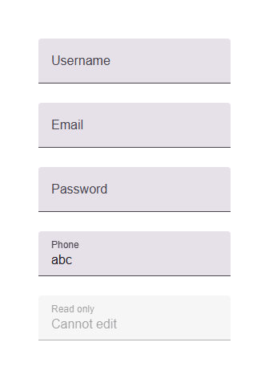

# @banegasn/m3-text-field




> Material Design 3 Text Field web component — framework-agnostic, built with Lit.

[](https://www.npmjs.com/package/@banegasn/m3-text-field)
[](../../LICENSE)

An accessible **M3 Text Field** web component following the [Material Design 3 text field specifications](https://m3.material.io/components/text-fields/overview). Supports filled and outlined variants with labels, helper text, error states, and leading/trailing icons. Works in Angular, React, Vue, Svelte, or plain HTML — no build step required.

## Features

- Filled and outlined variants
- Floating label animation
- Error and helper text states
- Leading and trailing icon slots
- Character counter support
- Keyboard accessible with proper ARIA attributes
- Framework-agnostic custom element

## Installation

```bash
npm install @banegasn/m3-text-field
# or
pnpm add @banegasn/m3-text-field
# or
yarn add @banegasn/m3-text-field
```

## CDN Usage (no build step)

```html
<!DOCTYPE html>
<html lang="en">
<head>
  <meta charset="UTF-8" />
  <title>M3 Text Field Demo</title>
  <script type="module" src="https://cdn.jsdelivr.net/npm/@banegasn/m3-text-field/+esm"></script>
  <style>
    body { font-family: Roboto, sans-serif; padding: 32px; background: #fef7ff; }
    .demo { display: flex; flex-direction: column; gap: 24px; max-width: 360px; }
  </style>
</head>
<body>
  <div class="demo">
    <!-- Filled (default) -->
    <m3-text-field label="Username" placeholder="Enter username"></m3-text-field>

    <!-- Outlined -->
    <m3-text-field variant="outlined" label="Email" type="email" placeholder="you@example.com"></m3-text-field>

    <!-- With helper text -->
    <m3-text-field label="Password" type="password" helper-text="At least 8 characters"></m3-text-field>

    <!-- Error state -->
    <m3-text-field label="Phone" error error-text="Invalid phone number" value="abc"></m3-text-field>

    <!-- Disabled -->
    <m3-text-field label="Read only" value="Cannot edit" disabled></m3-text-field>
  </div>

  <script>
    document.querySelectorAll('m3-text-field').forEach(field => {
      field.addEventListener('text-field-input', (e) => {
        console.log('Input:', e.detail.value);
      });
    });
  </script>
</body>
</html>
```

## npm Usage

```js
import '@banegasn/m3-text-field';
```

```html
<m3-text-field label="Name" placeholder="Enter your name"></m3-text-field>
<m3-text-field variant="outlined" label="Email" type="email"></m3-text-field>
<m3-text-field label="Password" type="password" helper-text="Min 8 characters"></m3-text-field>
```

## With Icons

```html
<!-- Leading icon -->
<m3-text-field label="Search" placeholder="Search...">
  <svg slot="leading-icon" viewBox="0 0 24 24" width="20" height="20">
    <path fill="currentColor" d="M15.5 14h-.79l-.28-.27A6.471 6.471 0 0 0 16 9.5 6.5 6.5 0 1 0 9.5 16c1.61 0 3.09-.59 4.23-1.57l.27.28v.79l5 4.99L20.49 19l-4.99-5zm-6 0C7.01 14 5 11.99 5 9.5S7.01 5 9.5 5 14 7.01 14 9.5 11.99 14 9.5 14z"/>
  </svg>
</m3-text-field>
```

## API

### Properties

| Property | Type | Default | Description |
|----------|------|---------|-------------|
| `variant` | `'filled' \| 'outlined'` | `'filled'` | Text field style variant |
| `label` | `string` | `''` | Floating label text |
| `placeholder` | `string` | `''` | Placeholder text |
| `value` | `string` | `''` | Current input value |
| `type` | `string` | `'text'` | Input type (text, email, password, etc.) |
| `disabled` | `boolean` | `false` | Disables the field |
| `required` | `boolean` | `false` | Marks the field as required |
| `error` | `boolean` | `false` | Shows error state |
| `error-text` | `string` | `''` | Error message text |
| `helper-text` | `string` | `''` | Helper text below the field |
| `maxlength` | `number \| null` | `null` | Maximum character count |
| `name` | `string \| null` | `null` | Name for form submission |

### Events

| Event | Detail | Description |
|-------|--------|-------------|
| `text-field-input` | `{ value: string, name: string \| null }` | Fired on every keystroke |
| `text-field-change` | `{ value: string, name: string \| null }` | Fired when value is committed |

### Slots

| Slot | Description |
|------|-------------|
| `leading-icon` | Icon displayed before the input |
| `trailing-icon` | Icon displayed after the input |

### CSS Custom Properties

| Property | Default | Description |
|----------|---------|-------------|
| `--md-sys-color-primary` | `#6750a4` | Focus indicator and label color |
| `--md-sys-color-error` | `#ba1a1a` | Error state color |
| `--md-sys-color-on-surface` | `#1d1b20` | Input text color |
| `--md-sys-color-surface-container-highest` | `#e6e0e9` | Filled variant background |

## Framework Usage

### Angular
```typescript
import '@banegasn/m3-text-field';
```
```html
<m3-text-field label="Name" [value]="name" (text-field-input)="name = $event.detail.value"></m3-text-field>
```

### React
```jsx
import '@banegasn/m3-text-field';
// <m3-text-field label="Name" value={name} ontext-field-input={(e) => setName(e.detail.value)} />
```

### Vue
```vue
<m3-text-field label="Name" :value="name" @text-field-input="name = $event.detail.value" />
```

## Resources

- [Material Design 3 Text Fields](https://m3.material.io/components/text-fields/overview)
- [GitHub Repository](https://github.com/banegasn/components)

## License

MIT
