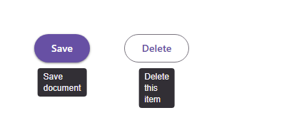

# @banegasn/m3-tooltip




> Material Design 3 Tooltip web component — framework-agnostic, built with Lit.

[](https://www.npmjs.com/package/@banegasn/m3-tooltip)
[](../../LICENSE)

An accessible **M3 Tooltip** web component following the [Material Design 3 tooltip specifications](https://m3.material.io/components/tooltips/overview). Supports plain and rich tooltip variants with smart positioning. Works in Angular, React, Vue, Svelte, or plain HTML — no build step required.

## Features

- Plain and rich tooltip variants
- Smart auto-positioning (top, bottom, left, right)
- Keyboard and hover triggered
- Accessible with ARIA `tooltip` role
- Framework-agnostic custom element

## Installation

```bash
npm install @banegasn/m3-tooltip
# or
pnpm add @banegasn/m3-tooltip
# or
yarn add @banegasn/m3-tooltip
```

## CDN Usage (no build step)

```html
<!DOCTYPE html>
<html lang="en">
<head>
  <meta charset="UTF-8" />
  <title>M3 Tooltip Demo</title>
  <script type="module" src="https://cdn.jsdelivr.net/npm/@banegasn/m3-tooltip/+esm"></script>
  <script type="module" src="https://cdn.jsdelivr.net/npm/@banegasn/m3-button/+esm"></script>
  <style>
    body { font-family: Roboto, sans-serif; padding: 80px 64px; background: #fef7ff; display: flex; gap: 48px; align-items: center; min-width: 350px; }
  </style>
</head>
<body>
  <!-- Plain tooltip -->
  <m3-tooltip text="Save document">
    <m3-button variant="filled">Save</m3-button>
  </m3-tooltip>

  <!-- Tooltip with bottom placement -->
  <m3-tooltip text="Delete this item" placement="bottom">
    <m3-button variant="outlined">Delete</m3-button>
  </m3-tooltip>

</body>
</html>
```

## npm Usage

```js
import '@banegasn/m3-tooltip';
```

```html
<!-- Wrap any element -->
<m3-tooltip text="Helpful hint">
  <button>Hover me</button>
</m3-tooltip>
```

## API

### Properties

| Property | Type | Default | Description |
|----------|------|---------|-------------|
| `text` | `string` | `''` | Plain tooltip text |
| `placement` | `'top' \| 'bottom' \| 'left' \| 'right'` | `'top'` | Preferred tooltip position |
| `delay` | `number` | `500` | Show delay in milliseconds |

### Slots

| Slot | Description |
|------|-------------|
| (default) | The trigger element |
| `title` | Rich tooltip title (activates rich variant) |
| `content` | Rich tooltip body content |

### CSS Custom Properties

| Property | Default | Description |
|----------|---------|-------------|
| `--md-sys-color-inverse-surface` | `#322f35` | Tooltip background |
| `--md-sys-color-inverse-on-surface` | `#f5eff7` | Tooltip text color |
| `--md-tooltip-shape` | `4px` | Tooltip border radius |

## Framework Usage

### Angular
```typescript
import '@banegasn/m3-tooltip';
```
```html
<m3-tooltip text="Edit item">
  <m3-button icon-only aria-label="Edit">...</m3-button>
</m3-tooltip>
```

### React
```jsx
import '@banegasn/m3-tooltip';
// <m3-tooltip text="Edit item"><button>Edit</button></m3-tooltip>
```

### Vue
```vue
<m3-tooltip text="Edit item">
  <button>Edit</button>
</m3-tooltip>
```

## Resources

- [Material Design 3 Tooltips](https://m3.material.io/components/tooltips/overview)
- [GitHub Repository](https://github.com/banegasn/components)

## License

MIT
