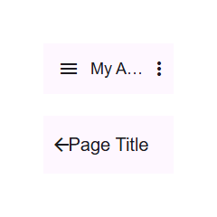

# @banegasn/m3-top-app-bar



Material Design 3 Top App Bar web component.

## Features

- **Variants**: `small`, `center-aligned`, `medium`, `large`
- **Slots**: `navigation-icon`, `headline` (default), `actions`
- **Elevation**: Smooth shadow transition with `elevated` attribute
- **Scroll behaviors**: `hide` and `shrink` modes
- **Accessible**: Proper `<header>` and `<h1>` semantics

## Installation

```bash
npm install @banegasn/m3-top-app-bar
```

## Usage

```html
<script type="module">
  import '@banegasn/m3-top-app-bar';
</script>

<!-- Small (default) -->
<m3-top-app-bar>
  <span slot="navigation-icon" class="material-symbols-outlined">menu</span>
  My App
  <span slot="actions" class="material-symbols-outlined">more_vert</span>
</m3-top-app-bar>

<!-- Center-aligned -->
<m3-top-app-bar variant="center-aligned">
  <span slot="navigation-icon" class="material-symbols-outlined">arrow_back</span>
  Page Title
</m3-top-app-bar>

<!-- Medium -->
<m3-top-app-bar variant="medium">
  <span slot="navigation-icon" class="material-symbols-outlined">menu</span>
  Headline
</m3-top-app-bar>

<!-- Large -->
<m3-top-app-bar variant="large">
  <span slot="navigation-icon" class="material-symbols-outlined">menu</span>
  Large Headline
</m3-top-app-bar>
```

## CDN Usage (no build step)

```html
<!DOCTYPE html>
<html lang="en">
<head>
  <meta charset="UTF-8" />
  <title>M3 Top App Bar Demo</title>
  <link rel="stylesheet" href="https://fonts.googleapis.com/css2?family=Material+Symbols+Outlined:opsz,wght,FILL,GRAD@24,400,0,0" />
  <script type="module" src="https://cdn.jsdelivr.net/npm/@banegasn/m3-top-app-bar/+esm"></script>
  <style>
    body { font-family: Roboto, sans-serif; padding: 32px; background: #fef7ff; margin: 0; }
    .col { display: flex; flex-direction: column; gap: 24px; }
  </style>
</head>
<body>
  <div class="col">
    <m3-top-app-bar>
      <span slot="navigation-icon" class="material-symbols-outlined">menu</span>
      My App
      <span slot="actions" class="material-symbols-outlined">more_vert</span>
    </m3-top-app-bar>
    <m3-top-app-bar variant="center-aligned">
      <span slot="navigation-icon" class="material-symbols-outlined">arrow_back</span>
      Page Title
    </m3-top-app-bar>
  </div>
</body>
</html>
```

## License

MIT
